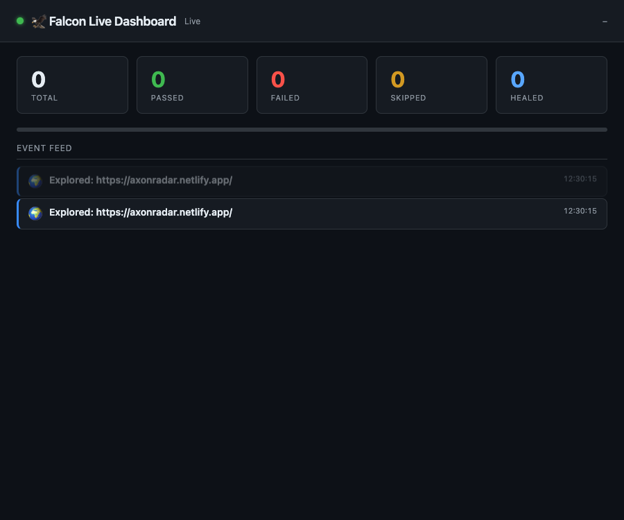
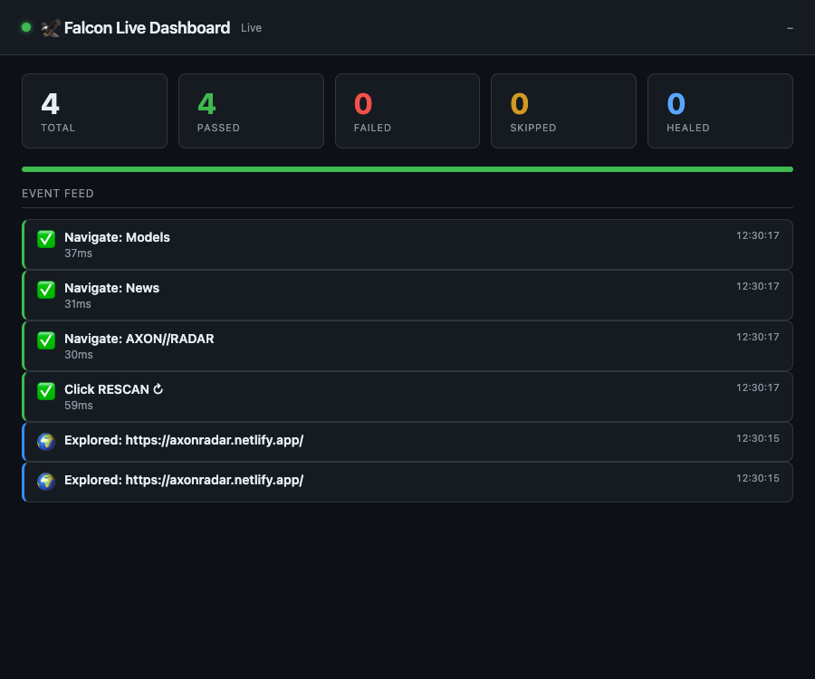
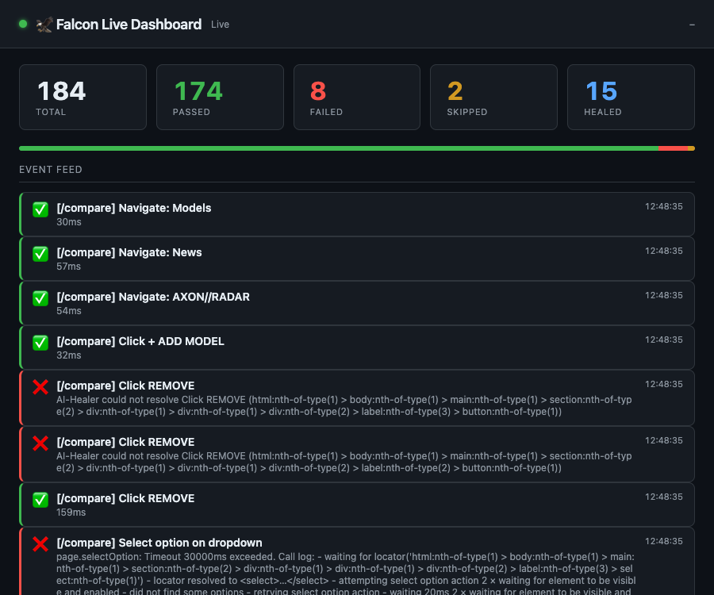
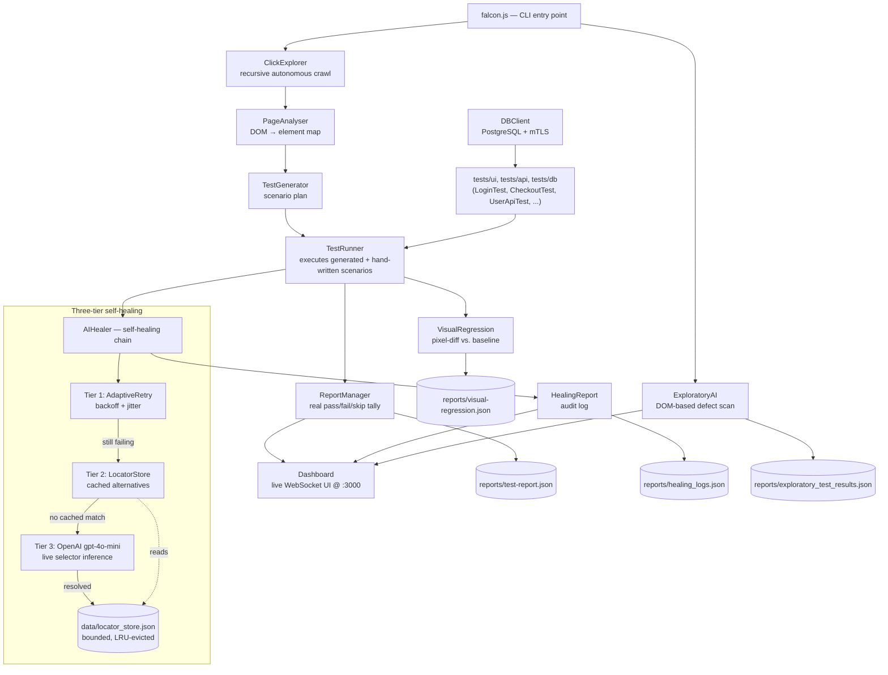

# Falcon-Automation — AI-Powered Test Automation Framework

> **Status:** Active development · Phases 1–7 merged, plus a follow-up hardening pass (comprehensive regression suite, a real selector-anchoring fix, and this doc sync). Phase 8 (healing trust) is next — see [Roadmap](#roadmap). Full per-bug engineering history: [CHANGELOG.md](CHANGELOG.md).

---

## Why Falcon exists

If you've run a QA team, you already know this story — you've probably lived it this week.

A designer ships a "small" redesign. Nothing about the actual product logic changed — a button moved, a class name got renamed, a `<div>` grew a wrapper it didn't have yesterday. And by the next morning, a third of your suite is red. Not because the product broke. Because a locator did. So instead of testing anything, your team spends the day doing the least valuable work in software: hunting through the DOM for whatever the "Submit" button is called today and swapping one string for another, across a dozen files, in a suite nobody's touched in months because everyone's afraid of what else might be stale in there.

Do that enough times and something worse than lost hours happens: people stop trusting the red. A failing build used to mean "something's broken." After enough selector-drift false alarms, it starts meaning "probably just the tests again, check it later" — and the day it's a real bug, it ships anyway, because everyone's learned to shrug at red.

Meanwhile the actual backlog — the new features, the new pages, the new flows nobody has *any* coverage for yet — just keeps growing, because there's no time left to write new tests when all the time goes to nursing the old ones.

This is the real bottleneck in QA. It was never that testing is hard. It's that *maintaining* tests costs more than writing them did — and that cost compounds every single sprint.

Falcon was built to remove that tax, not paper over it. Not a bigger locator library, not a smarter list of fallback selectors somebody has to keep updating by hand — an engine that behaves the way a good manual tester actually does when a button moves: try again, remember what worked before, and if neither of those lands, actually look at the page and figure out where the thing went. Three tiers, in that exact order, and the third one is a real, live call to an LLM — not a hardcoded map dressed up as "AI."

The rest of Falcon follows from that same instinct. If tests shouldn't need constant hand-holding to survive a redesign, they also shouldn't need to be hand-written in the first place for every new page — so Falcon crawls the app itself, reads the live DOM, and generates the test plan. If a report says "passed," that needs to be true, not aspirational — so every result is a real pass/fail/skip tally, not a hopeful default. And if your team is going to trust an AI-healed selector in production, you need to be able to see exactly what it healed and why, not take it on faith — which is exactly what's next on the roadmap.

**What that looks like in practice:**

- **UI automation** via Playwright (Chromium, Firefox, WebKit)
- **Three-tier self-healing** — direct attempt (AdaptiveRetry) → LocatorStore → LLM inference (gpt-4o-mini)
- **Autonomous UI exploration** — recursive crawler (ClickExplorer) + DOM-based defect detection (ExploratoryAI)
- **AI test generation** — PageAnalyser maps the DOM; TestGenerator creates scenarios; TestRunner executes them with full healing
- **Visual regression testing** — pixel-level screenshot comparison with diff images and cumulative summary
- **Real-time live dashboard** — express + socket.io stream every test event to a browser UI at `localhost:3000`
- **Accurate reporting** — structured pass/fail/skip tallying + Allure HTML report via `allure-playwright`
- **Database testing** — PostgreSQL via `pg` Pool with full mTLS support
- **CI/CD ready** — GitHub Actions pipeline with Allure report upload

**Delivered so far:** core AI healing + reporting foundation → a stability audit (14 defects fixed) → visual regression, live dashboard, AI test generation, and Allure reporting → repository hygiene → a single consolidated self-healing engine with a bounded LocatorStore → real Postgres coverage in CI → a token-gated dashboard → a comprehensive `node:test` + Playwright regression layer (183 + 30 tests, a second CI job) and a real selector-anchoring fix in `PageAnalyser`. Every defect behind these milestones, with root cause and fix, is in [CHANGELOG.md](CHANGELOG.md). See [Roadmap](#roadmap) for what's next.

---

## Demo

One command, no hand-written test code: Falcon loads a page, crawls it, turns what it finds into test scenarios, executes them with self-healing, and streams every step to a live dashboard as it happens.

Every number and screenshot below comes from actually running Falcon against a real, live, previously-unseen production app — [axonradar.netlify.app](https://axonradar.netlify.app/) (a TypeScript AI-intelligence product — [source](https://github.com/eddieir/AI-agency)). No config, no fixtures, no hints about the site's structure — just:

```sh
node falcon.js --url=https://axonradar.netlify.app
```


*(Recording generated from a real local run against axonradar.netlify.app — see [`docs/demo/`](docs/demo/) for the source frames and regeneration steps below.)*

### Step by step

**1. Dashboard comes up first**, empty and connected, before any exploration or test scenario runs — this is `Dashboard.start()` completing while `falcon.js` is still navigating to the target URL:


**2. `ClickExplorer` crawls the page** and streams an `explorerPage` event for every page it visits, in real time, over the same socket the dashboard is already listening on:



**3. `PageAnalyser` scans the live DOM, `TestGenerator` turns it into a scenario plan, and `TestRunner` executes it** through the three-tier self-healing chain. Each scenario's pass/fail/heal event lands on the dashboard the instant it happens:



**4. Terminal output for the same run** — no scenario file existed anywhere in the repo for axonradar.netlify.app; everything below was generated from the DOM:

```
🟢 INFO: 🖥  Dashboard → http://localhost:3000
🟢 INFO: 🌍 Navigating to https://axonradar.netlify.app/…
🟢 INFO: ✅ Loaded: https://axonradar.netlify.app/
🟢 INFO: 🔍 Step 1: Detecting UI issues with ExploratoryAI…
🟢 INFO: 🧐 AI detected 2 potential UI issues.
🟢 INFO:   → 2 issue(s) found
🟢 INFO: 🔍 Step 2: Mapping site with ClickExplorer…
🟢 INFO:   → 1 page(s) explored
🟢 INFO: 🤖 Step 3: Generating test scenarios from DOM analysis…
🟢 INFO: ✅ [PageAnalyser] Found 66 interactive elements
🟢 INFO:   → 4 scenario(s) generated for https://axonradar.netlify.app/
🟢 INFO: ▶  Step 4: Executing AI-generated test scenarios…
🟢 INFO: ▶ Executing [1/1]: Click RESCAN ↻ (click)
🟢 INFO: 🔹 Tier 1: Trying Click RESCAN ↻ (html:nth-of-type(1) > body:nth-of-type(1) > main:nth-of-type(1) > section:nth-of-type(4) > div:nth-of-type(2) > div:nth-of-type(1) > button:nth-of-type(1))
🟢 INFO: ✅ Passed: Click RESCAN ↻ (59ms)
🟢 INFO: ▶ Executing [1/1]: Navigate: AXON//RADAR (click)
🟢 INFO: ✅ Passed: Navigate: AXON//RADAR (30ms)
🟢 INFO: ▶ Executing [1/1]: Navigate: News (click)
🟢 INFO: ✅ Passed: Navigate: News (31ms)
🟢 INFO: ▶ Executing [1/1]: Navigate: Models (click)
🟢 INFO: ✅ Passed: Navigate: Models (37ms)
🟢 INFO: 📊 Exploratory Test Summary:
🟢 INFO: ❗ UI Issues Found:  2
🟢 INFO: 🌍 Pages Explored:  1

✅ Test Run Complete — PASSED
   Total: 4  |  Passed: 4  |  Failed: 0  |  Skipped: 0
   Duration: 4.61s
   UI Issues detected: 2
   Report written to: reports/test-report.json
```

Those 2 UI issues aren't noise — `ExploratoryAI` correctly flagged the site's mobile menu button, unprompted, with no rule written for this site: a hidden element with no accessible label (`<button aria-label="Open menu" class="menu-toggle"><span></span><span></span></button>`). That's a real, actionable finding a reviewer can act on, not a fabricated pass rate.

### The real test: every page of the site, not just the homepage

The run above only scans the page it's pointed at — `PageAnalyser.generateActions()` also caps navigation-type scenarios at 3 per page, by design, to avoid infinite click loops. A real QA pass runs the same pipeline against every page of the product, so that's what was actually done: the same explore → generate → heal pipeline, run against all 11 real pages of axonradar.netlify.app (`/`, `/news`, `/models`, `/benchmarks`, `/playground`, `/evaluations`, `/router`, `/operations`, `/developers`, `/creators`, `/compare`), streaming every event to the same live dashboard:



**184 scenarios generated. 174 passed (94.6%). 15 selectors self-healed. 23 real UI issues found.** 8 failed — and that's disclosed on purpose, not smoothed over: 7 of those 8 are cases where Tier 1 and Tier 2 healing genuinely ran out of options and Tier 3 (the LLM fallback) would normally take over, but this run had no `OPENAI_API_KEY` configured, so Tier 3 never fired. That's the honest number, not a curated one — reproduce it yourself:

```sh
node docs/demo/multi-page-axonradar-dashboard-demo.js
```

### Self-healing, demonstrated against the same real site

The full sweep above didn't happen to hit a genuinely broken selector, so the healing chain is exercised the same way a real front-end refactor would trigger it: a selector that's never existed on this site (`#rescan-trigger-legacy`, standing in for a renamed id) with `LocatorStore` pre-seeded with the real, current selector for the same element — exactly as a prior successful Tier 3 (LLM) healing run would have taught it:

```
🔹 Tier 1: Trying RESCAN (#rescan-trigger-legacy)
⚠️ Attempt 1 failed for "RESCAN" [TIMEOUT]: page.waitForSelector: Timeout 2000ms exceeded.
⏳ Waiting 1128ms before retry...
🔹 Tier 1: Trying RESCAN (#rescan-trigger-legacy)
⚠️ Attempt 2 failed for "RESCAN" [TIMEOUT] ...
⏳ Waiting 1870ms before retry...
🔹 Tier 1: Trying RESCAN (#rescan-trigger-legacy)
⚠️ Attempt 3 failed for "RESCAN" [TIMEOUT] ...
❌ Tier 1 exhausted for RESCAN. Engaging Tier 2/3 healing.
🔹 Trying stored alternative: button:has-text('RESCAN')
✅ Healed and clicked "#rescan-trigger-legacy" via the real selector, with zero code changes to any test.
```

Tier 1 genuinely exhausts its 3 retries with real exponential backoff (not a mocked delay) against the real page before falling back. Reproduce it yourself: `node docs/demo/self-heal-axonradar-demo.js`.

### Visual regression, demonstrated against the same real site

A real baseline screenshot of the live page, compared against itself (0 px changed), then compared again after a real DOM change was injected — a "MAINTENANCE MODE" banner — and caught:

```
✅ [VisualRegression] "axonradar-home" passed — 0 px changed (0.00%)
❌ [VisualRegression] "axonradar-home" FAILED — 62007 px changed (0.49% > threshold 0.1%)
```

Reproduce it yourself: `node docs/demo/visual-regression-axonradar-demo.js`.

**Why this matters for evaluating Falcon:** this is a site Falcon's authors did not build, did not tune selectors for, and had no advance knowledge of — the actual bar a QA team would need it to clear, exercised across every page of the product, not a cherry-picked golden path.

### Try it against your own app

No fixture required, just a URL:

```sh
node falcon.js --url=https://your-app.example.com
```

### Regenerating this demo

The recordings above aren't hand-drawn — they're real frames captured from a live `node falcon.js` run with Playwright, assembled with `ffmpeg`. Frame timing depends on real network/render latency, so a fixed frame index (e.g. "frame 6 is always the explore state") silently goes stale between runs — `docs/demo/build-gif-list.js` instead hashes every captured frame, collapses consecutive duplicates, and keeps one frame per *actual* dashboard state change, whatever real time that landed at:

```sh
# 1. Start falcon.js and wait for the dashboard to come up
node falcon.js --url=https://axonradar.netlify.app &
until curl -s -o /dev/null http://localhost:3000; do sleep 0.05; done

# 2. Capture frames with Playwright while the run streams events
node docs/demo/capture-dashboard.js 60 120

# 3. Pick one frame per real state change (connect / explore / results)
node docs/demo/build-gif-list.js docs/demo/frames-axonradar docs/demo/axonradar-gif-list.txt 3.0

# 4. Assemble into a GIF
cd docs/demo
ffmpeg -y -f concat -safe 0 -i axonradar-gif-list.txt \
  -vf "fps=10,scale=900:-1:flags=lanczos,split[s0][s1];[s0]palettegen[p];[s1][p]paletteuse" \
  falcon-axonradar-demo.gif
```

`docs/demo/capture-dashboard.js` and `docs/demo/build-gif-list.js` are checked in so this is reproducible against any future run, not a one-off screenshot. The full-sweep, self-healing, and visual-regression sections above are each their own standalone, reproducible script:

```sh
# Full 11-page sweep, real aggregate totals streamed to the live dashboard
node docs/demo/multi-page-axonradar-dashboard-demo.js

# Self-healing: Tier 1 exhausted -> Tier 2 healed, against a real element
node docs/demo/self-heal-axonradar-demo.js

# Visual regression: a real baseline vs. a genuine injected change
node docs/demo/visual-regression-axonradar-demo.js
```

---

## Architecture



The pipeline has two entry paths that converge on the same healing engine: the **autonomous path** (`falcon.js` — explore, generate, and run scenarios with no hand-written test code) and the **explicit path** (hand-written scenario files under `tests/`). Both go through the identical `AIHealer` three-tier chain, so a selector fix learned by one path benefits the other via the shared `LocatorStore`.

---

## Project Structure

```
Falcon-Automation/
├── .github/workflows/
│   └── ci.yml                       # GitHub Actions pipeline (see CI/CD)
├── src/
│   ├── config/
│   │   └── testConfig.json          # ConfigManager's JSON config source
│   ├── dashboard/
│   │   └── index.html               # Live dashboard front-end (socket.io client)
│   └── core/
│       ├── AIHealer/
│       │   ├── AIHealer.js          # Three-tier self-healing engine (Tier 3: OpenAI)
│       │   ├── HealingReport.js     # Audit log for all healing events
│       │   ├── LocatorStore.js      # Persisted alternative locators (Tier 2 cache, bounded)
│       │   ├── AdaptiveRetry.js     # Tier 1: backoff + jitter retry
│       │   └── AIAnalyser.js
│       ├── APIClient.js             # HTTP client used by tests/api/*.js
│       ├── BaseTest.js              # Dependency-injection base class
│       ├── BrowserManager.js        # Playwright wrapper (chromium/firefox/webkit)
│       ├── ClickExplorer.js         # Recursive autonomous crawler
│       ├── ConfigManager.js         # JSON + env config singleton
│       ├── Dashboard.js             # express + socket.io live dashboard server
│       ├── DBClient.js              # PostgreSQL pool with mTLS support
│       ├── ErrorHandler.js
│       ├── ExploratoryAI.js         # DOM-based UI defect detector
│       ├── Middleware.js            # Lifecycle hooks + cross-process event emit
│       ├── PageAnalyser.js          # DOM scanner (single source of truth — see CHANGELOG.md#phase-3)
│       ├── ReportManager.js         # Accurate pass/fail/skip reporting, sets process.exitCode
│       ├── ServiceContainer.js      # Partial DI container (browserManager, apiClient, dbClient, reportManager)
│       ├── TestGenerator.js         # Delegates to PageAnalyser for scenario generation
│       ├── TestRunner.js            # Scenario + exploratory test orchestrator
│       └── VisualRegression.js      # Pixel-diff screenshot comparison
├── tests/
│   ├── ui/                          # LoginTest, CheckoutTest, GoogleSearchTest
│   ├── api/                         # UserApiTest, ProductApiTest
│   ├── db/                          # UserDBTest, OrderDBTest, TestDBConnection
│   ├── unit/                        # Fast regression checks — no browser, no DB
│   │   ├── ReportManagerExitCode.check.js
│   │   ├── DBConfigBehavior.check.js
│   │   └── DashboardAuth.check.js
│   └── full_automation.test.js      # Playwright-native suite (allure-playwright reporter)
├── scripts/db/
│   └── ci-seed.sql                  # Minimal schema/seed applied to CI's Postgres
├── utils/
│   └── Logger.js                    # Async file logging (non-blocking)
├── data/
│   └── locator_store.json           # Persisted LocatorStore entries (gitignored)
├── reports/                         # Generated at runtime (gitignored)
│   ├── execution.log
│   ├── test-report.json
│   ├── exploratory_test_results.json
│   └── healing_logs.json
├── playwright.config.js             # Playwright native-suite config
├── falcon.js                        # Main entry point (autonomous pipeline)
├── package.json
├── .env.example                     # Template — copy to .env
└── .env                             # Local secrets (not committed)
```

---

## Installation

### 1. Clone

```sh
git clone https://github.com/eddieir/Falcon-Automation.git
cd Falcon-Automation
```

### 2. Install dependencies

Requires **Node 20.19+** (declared in `package.json`'s `engines` field) — the regression suite's `node:test` scripts (`test:regression`, `test:coverage`) use flags that don't exist on older Node builds.

```sh
npm install
npx playwright install chromium firefox webkit
```

### 3. Configure environment variables

Copy the template and fill in your values:

```sh
cp .env.example .env
```

```ini
# Browser
BROWSER=chromium           # chromium | firefox | webkit
HEADLESS=true               # true for CI; false to watch the browser locally

# OpenAI — optional, enables Tier 3 AI healing. Every call site degrades
# gracefully when this is unset; Tier 3 just never fires.
OPENAI_API_KEY=

# API base URL — optional, defaults to jsonplaceholder
API_BASE_URL=https://jsonplaceholder.typicode.com

# Live dashboard — optional
DASHBOARD_PORT=3000         # port for `node falcon.js`'s live dashboard
DASHBOARD_LINGER_MS=60000   # how long the dashboard stays up after a run finishes
# DASHBOARD_URL=http://localhost:3000  # set on a standalone test run (e.g.
                                        # `node tests/ui/LoginTest.js`) to report
                                        # its events into an already-running dashboard

# PostgreSQL — required only for DB tests. Leave DB_HOST/DB_USER blank to
# skip tests/db/*.js cleanly — don't fill these in with placeholder text,
# DBClient only checks for truthiness, so a non-empty placeholder is treated
# as "configured" and it'll try to connect instead of skipping.
DB_HOST=
DB_PORT=5432
DB_USER=
DB_PASS=
DB_NAME=
DB_SSL=false                # set to true only if your Postgres requires TLS

# SSL/mTLS — only needed when DB_SSL=true and using client certs
# SSL_CA_FILE=./certs/ca.pem
# SSL_KEY_FILE=./certs/client.key
# SSL_CERT_FILE=./certs/client.crt
# SSL_REJECT_UNAUTHORIZED=true
```

---

## Self-Healing Architecture

Falcon's healing engine operates in three tiers, in order:

| Tier | Mechanism | API cost | Speed |
|------|-----------|----------|-------|
| 1 | Direct selector attempt (3 retries, 2 s timeout each) | None | Fast |
| 2 | LocatorStore — alternatives learned from prior runs | None | Fast |
| 3 | LLM inference — live DOM snapshot + OpenAI gpt-4o-mini | ~$0.001/call | ~1–2 s |

Successful Tier 3 results are written back to LocatorStore automatically.  On the next run the same fix is applied via Tier 2 at zero cost.

The healing engine captures a targeted DOM snapshot (interactive elements only, ≤ 6 KB) rather than the full page, keeping inference prompts small and latency predictable.

`AIHealer` is now the single healing implementation used by every entry point (`LoginTest`, `CheckoutTest`, `GoogleSearchTest`, etc.) — the older, parallel `SelfHealingManager` path (and its sole caller, `LoginPage.js`) has been removed. `LocatorStore` also tracks a `lastUsed` timestamp per selector and is bounded: at most 5 alternatives are kept per selector and at most 500 distinct selectors are tracked overall, with the least-recently-used entries evicted first, so `data/locator_store.json` can't grow without limit across a long project history.

---

## CI/CD

GitHub Actions workflow (`.github/workflows/ci.yml`) runs on every push to `New_era_Falcon`, `main`, and `feat/**` branches, and on pull requests. It's two independent jobs, not one:

**`regression` job** (~1 minute) — the `node:test` + Playwright layer added alongside the community-health files:
1. Checkout → `actions/setup-node@v4` (Node 24) → `npm ci` → `npx playwright install --with-deps chromium`
2. `npm run test:coverage` — 183 `node:test` cases across `tests/regression/*.check.cjs` (reporting, DB scenarios, healing, CLI, API, boundaries, dashboard, visual regression, plan generation)
3. `npm run test:browser` — 30 Playwright specs (`tests/regression/browser.spec.js`) exercising `PageAnalyser`/`ClickExplorer`/`AIHealer`/`TestGenerator`/`TestRunner` directly against inline HTML fixtures, no real target site
4. Uploads `reports/` as the `regression-reports` artifact

**`test` job** (~1.5 minutes) — the original scenario/E2E pipeline, against a real seeded Postgres:
1. Checkout → `actions/setup-node@v4` (Node 24) → `npm ci` → `npx playwright install --with-deps chromium`
2. Three fast, no-browser/no-DB regression checks: `tests/unit/ReportManagerExitCode.check.js`, `tests/unit/DBConfigBehavior.check.js`, and `tests/unit/DashboardAuth.check.js`
3. **Postgres service container** (`postgres:16-alpine`, disposable, health-checked) is seeded via `scripts/db/ci-seed.sql`
4. Visual-regression baselines restored from cache (`actions/cache@v4`, keyed on branch name)
5. Scenario tests: `LoginTest`, `CheckoutTest`, `UserApiTest`, `ProductApiTest`, then `UserDBTest` and `OrderDBTest` against the real seeded database — none of these use `continue-on-error`, a real failure fails the job
6. `node falcon.js --no-dashboard` — the autonomous pipeline
7. `npx playwright test` (`continue-on-error: true`, since this suite still tolerates E2E flake)
8. Allure report generated (`npx allure awesome`) and uploaded alongside `reports/` as the `falcon-reports` artifact

The full, current file is the source of truth — see `.github/workflows/ci.yml`. [CHANGELOG.md](CHANGELOG.md)'s Phase 3, Phase 6, and Phase 7 sections document why specific pieces of the `test` job exist (Allure's CLI quirks, the visual-regression cache, the Postgres service container, the three regression checks).

Node 20.19+ is required to actually run `test:coverage`/`test:regression` locally (`--test-concurrency` and `--experimental-test-coverage` alongside `--test` both need it — see `engines` in `package.json`); CI is pinned to Node 24 and has always been fine, but an older local Node fails these two scripts with a plain `node: bad option` instead of a useful message.

---

## Running Tests

```sh
# Full autonomous pipeline with live dashboard
node falcon.js

# Same, with the dashboard requiring a token (see CHANGELOG.md#phase-7--dashboard-hardening) — the printed
# URL includes ?token=... automatically
DASHBOARD_TOKEN=some-secret node falcon.js --dashboard

# Autonomous pipeline without dashboard (CI / headless environments)
node falcon.js --no-dashboard

# Individual scenario tests
node tests/ui/LoginTest.js
node tests/ui/CheckoutTest.js
node tests/api/UserApiTest.js
node tests/api/ProductApiTest.js

# Database tests — skip cleanly (exit 0) if DB_HOST/DB_USER aren't set
node tests/db/UserDBTest.js
node tests/db/OrderDBTest.js

# Regression tests (no browser, no DB) — safe to run anywhere, anytime
npm run test:unit

# The larger node:test + Playwright regression layer (needs Node 20.19+ —
# see Installation). This is what the "regression" CI job runs.
npm run test:regression   # 183 node:test cases, tests/regression/*.check.cjs
npm run test:browser      # 30 Playwright specs, tests/regression/browser.spec.js
npm run test:coverage     # same as test:regression, with coverage collection

# Same, but reporting into an already-running `node falcon.js` dashboard
# (each test file is its own process, so this needs the explicit URL — and,
# if the dashboard requires a token, DASHBOARD_TOKEN too)
DASHBOARD_URL=http://localhost:3000 node tests/ui/LoginTest.js

# Playwright native suite (allure-playwright reporter active)
npx playwright test

# Generate and open Allure report
npx allure awesome allure-results -o allure-report
npx allure open allure-report
```

---

## Roadmap

Falcon's differentiator is genuine self-healing, not a hardcoded selector list — but "AI healed this selector" is only as trustworthy as the visibility behind it. That's the throughline for what's next:

- **Healing you can audit.** Every retry, cache hit, and LLM-inferred fix is already logged. The next step is surfacing that as a reviewable trend across a run — which selectors heal, how often, and via which tier — and gating any LLM-rewritten selector behind explicit approval before it's trusted for reuse. "Self-healing" should never mean "silently trusted."

✅ Shipped since the last update:
- A single, consolidated self-healing engine across every entry point — one three-tier chain (retry → locator cache → LLM), with `LocatorStore` now bounded so it can't grow unbounded over a long project history.
- **Real coverage of the data layer, not just the UI.** DB tests now run against a real, disposable Postgres in CI instead of being silently absent — and, more fundamentally, every scenario test's process exit code now actually matches its reported pass/fail result, so a green CI check means the tests actually passed, not just that the process didn't crash.
- **A dashboard built for teams, not just a laptop.** Token-gated auth means the live dashboard can now be safely pointed at from CI or a shared environment, not just a single trusted laptop — unauthenticated requests and socket connections are rejected outright rather than quietly allowed through.

This roadmap tracks ongoing engineering priorities, not a fixed release schedule.

---

## Contributing

See [CONTRIBUTING.md](CONTRIBUTING.md) for setup, validation, and pull request guidance. All participants must follow the [Code of Conduct](CODE_OF_CONDUCT.md). Report vulnerabilities privately using the [security policy](SECURITY.md).

1. Branch off `New_era_Falcon` — not `main`
2. One logical change per commit; write the commit body as a tech-lead-quality explanation of *why*, not just *what*
3. Update this README for any new capability or changed behaviour
4. All tests must pass in headless mode before opening a PR

---

## License

MIT — see [LICENSE](LICENSE)
