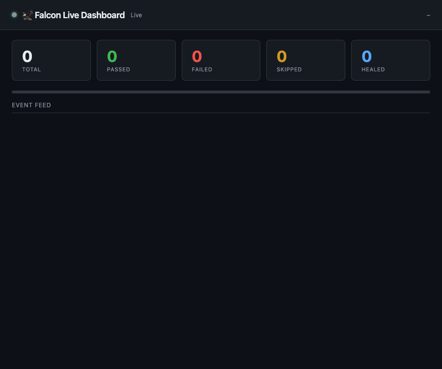
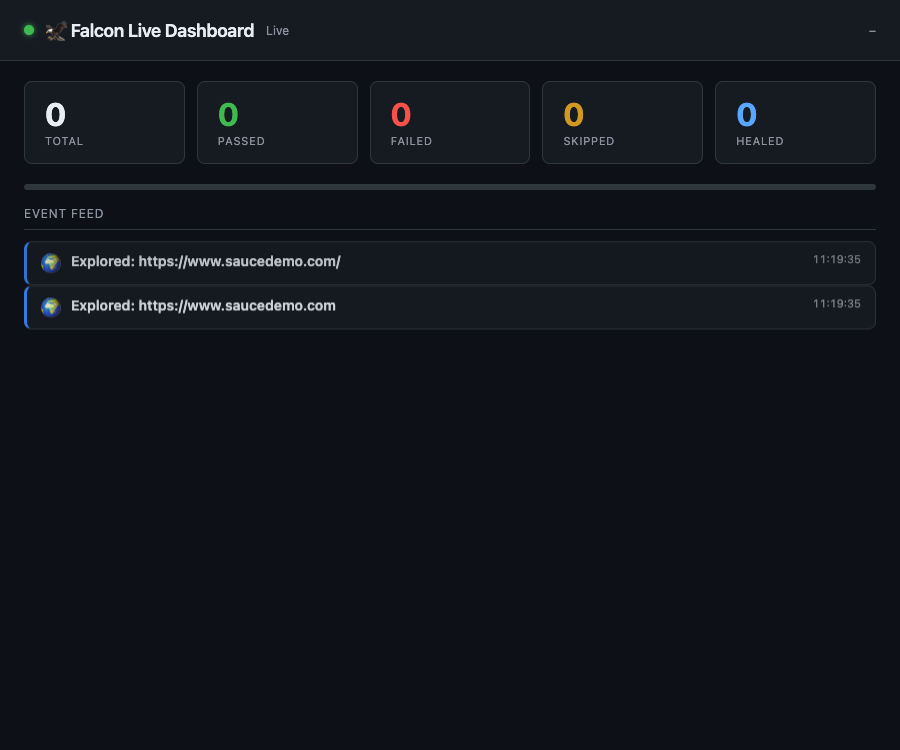
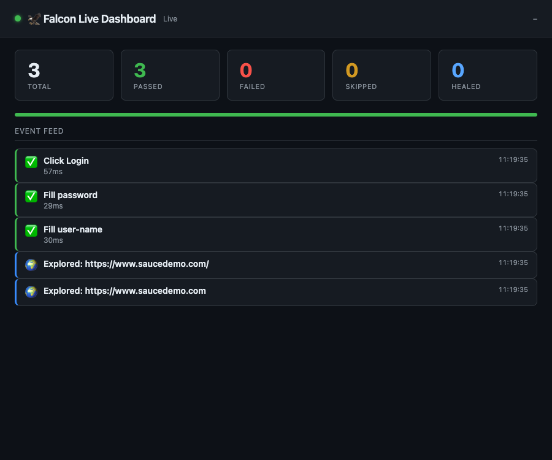
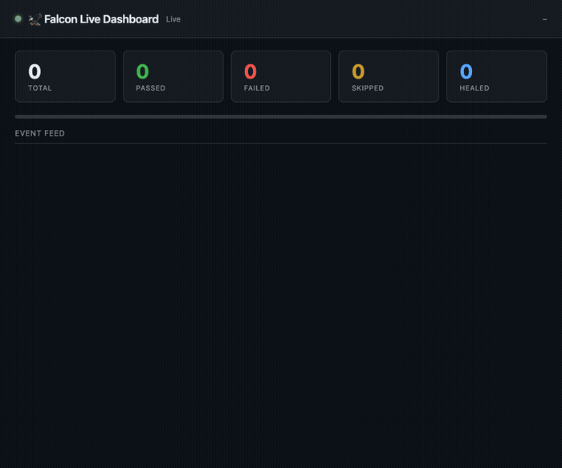
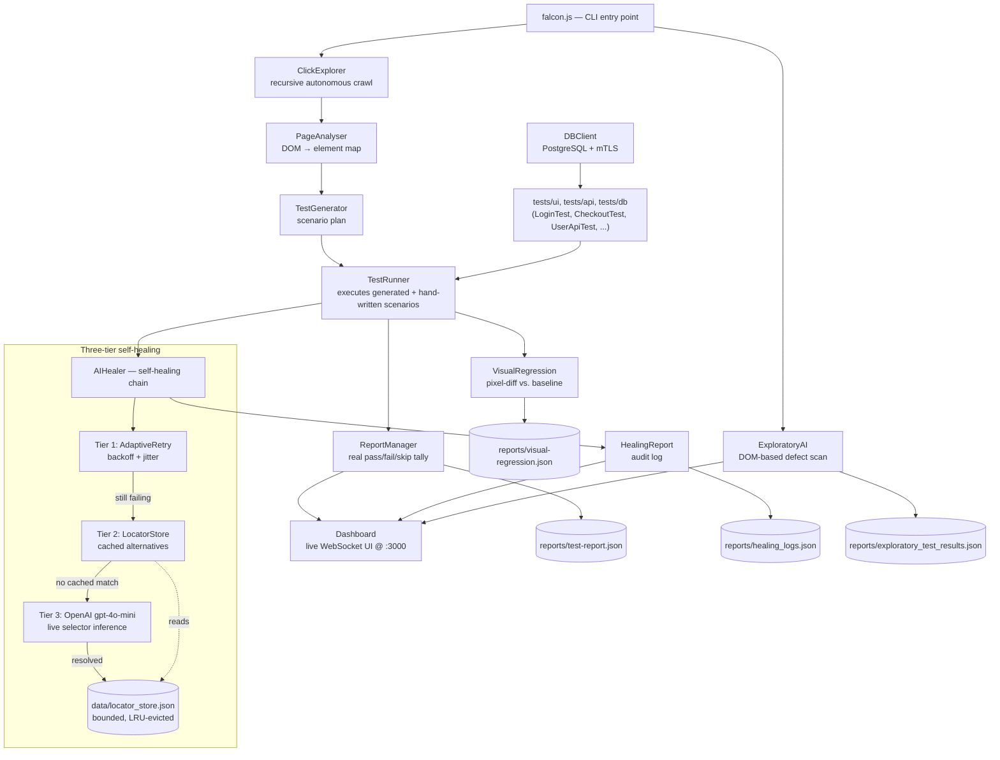

# Falcon-Automation — AI-Powered Test Automation Framework

> **Status:** Active development · Phases 1–7 merged, plus a follow-up hardening pass (comprehensive regression suite, a real selector-anchoring fix, and this doc sync). Phase 8 (healing trust) is next — see [Roadmap](#roadmap).

---

## Overview

Falcon is an open-source test automation framework built on Playwright that integrates a genuine LLM-powered self-healing engine.  Unlike most "AI testing" tools that use static heuristics or hardcoded fallback maps, Falcon's three-tier healing chain falls back to a live OpenAI inference call when all attribute-based alternatives have been exhausted.

**Core capabilities:**

- **UI automation** via Playwright (Chromium, Firefox, WebKit)
- **Three-tier self-healing** — direct attempt (AdaptiveRetry) → LocatorStore → LLM inference (gpt-4o-mini)
- **Autonomous UI exploration** — recursive crawler (ClickExplorer) + DOM-based defect detection (ExploratoryAI)
- **AI test generation** — PageAnalyser maps the DOM; TestGenerator creates scenarios; TestRunner executes them with full healing
- **Visual regression testing** — pixel-level screenshot comparison with diff images and cumulative summary
- **Real-time live dashboard** — express + socket.io stream every test event to a browser UI at `localhost:3000`
- **Accurate reporting** — structured pass/fail/skip tallying + Allure HTML report via `allure-playwright`
- **Database testing** — PostgreSQL via `pg` Pool with full mTLS support
- **CI/CD ready** — GitHub Actions pipeline with Allure report upload

**Delivered so far:** [Phase 1](#phase-1--stabilisation-changelog) (core AI healing + reporting foundation) → [Phase 2](#phase-2--stability--coverage) (stability audit, 14 defects fixed) → [Phase 3](#phase-3--competitive-features) (visual regression, live dashboard, AI test generation, Allure) → [Phase 4](#phase-4--repository-hygiene--documentation-truth) (repo hygiene, docs truth) → [Phase 5](#phase-5--self-healing-consolidation) (single consolidated healing engine, bounded LocatorStore) → [Phase 6](#phase-6--ci-database-coverage) (real Postgres in CI, CI results that actually gate merges) → [Phase 7](#phase-7--dashboard-hardening) (token-gated dashboard, no more open read/write access) → a comprehensive `node:test` + Playwright regression layer (183 + 30 tests, a second CI job) and a real selector-anchoring fix in `PageAnalyser`. See [Roadmap](#roadmap) for what's next.

---

## Demo

One command, no hand-written test code: Falcon loads a page, crawls it, turns what it finds into test scenarios, executes them with self-healing, and streams every step to a live dashboard as it happens.

```sh
node falcon.js --url=https://www.saucedemo.com
```


*(Recording generated from a real local run against saucedemo.com — see [`docs/demo/`](docs/demo/) for the source frames and regeneration steps below.)*

### Step by step

**1. Dashboard comes up first**, empty and connected, before any exploration or test scenario runs — this is `Dashboard.start()` completing while `falcon.js` is still navigating to the target URL:



**2. `ClickExplorer` crawls the page** and streams an `explorerPage` event for every page it visits, in real time, over the same socket the dashboard is already listening on:



**3. `PageAnalyser` scans the live DOM, `TestGenerator` turns it into a scenario plan, and `TestRunner` executes it** through the three-tier self-healing chain. Each scenario's pass/fail/heal event lands on the dashboard the instant it happens:



**4. Terminal output for the same run** — no scenario file existed anywhere in the repo for saucedemo.com; everything below was generated from the DOM:

```
🟢 INFO: 🖥  Dashboard → http://localhost:3000
🟡 WARNING: ⚠️  Dashboard running WITHOUT auth (DASHBOARD_TOKEN not set) — anyone who can reach this port can read and write test events. Fine for a local laptop; set DASHBOARD_TOKEN before exposing this beyond localhost.
🟢 INFO: 🌍 Navigating to https://www.saucedemo.com…
🟢 INFO: ✅ Loaded: https://www.saucedemo.com
🟢 INFO: 🔍 Step 1: Detecting UI issues with ExploratoryAI…
🟢 INFO: 🧐 AI detected 0 potential UI issues.
🟢 INFO: 🔍 Step 2: Mapping site with ClickExplorer…
🟢 INFO:   → 1 page(s) explored
🟢 INFO: 🤖 Step 3: Generating test scenarios from DOM analysis…
🟢 INFO: ✅ [PageAnalyser] Found 4 interactive elements
🟢 INFO:   → 3 scenario(s) generated for https://www.saucedemo.com/
🟢 INFO: ▶  Step 4: Executing AI-generated test scenarios…
🟢 INFO: ▶ Executing [1/3]: Fill user-name (type)
🟢 INFO: ✅ Passed: Fill user-name (30ms)
🟢 INFO: ▶ Executing [1/3]: Fill password (type)
🟢 INFO: ✅ Passed: Fill password (29ms)
🟢 INFO: ▶ Executing [1/1]: Click Login (click)
🟢 INFO: 🔁 [AdaptiveRetry] Attempt 1/3: Click Login
🟢 INFO: 🔹 Tier 1: Trying Click Login (#login-button)
🟢 INFO: ✅ Passed: Click Login (57ms)

✅ Test Run Complete — PASSED
   Total: 3  |  Passed: 3  |  Failed: 0  |  Skipped: 0
   Duration: 1.69s
   Report written to: reports/test-report.json
```

**Try it against your own app** — no fixture required, just a URL:

```sh
node falcon.js --url=https://your-app.example.com
```

### Real-world case study — a live site Falcon had never seen before

The saucedemo run above is a known fixture. To show Falcon actually holds up against something it has no prior knowledge of, it was pointed at a real, independently-built, publicly deployed site: [peymaniravani.netlify.app](https://peymaniravani.netlify.app) (a Next.js + Tailwind CSS single-page portfolio — [source](https://github.com/eddieir/Peyman_Iravani_QA_Portfolio)). No config, no fixtures, no hints about the site's structure — just:

```sh
node falcon.js --url=https://peymaniravani.netlify.app
```



**What happened, unscripted:**

1. **`ClickExplorer` mapped the site's real navigation** — a single-page app with anchor-link sections (`#about`, `#skills`, `#experiences`, `#projects`), not a traditional multi-page site — and explored all 6 URL states it produces, respecting the crawler's depth bound so it doesn't loop forever on a site with no distinct pages to exhaust.
2. **`PageAnalyser` found 29 real interactive elements** on the page — nav links, a "Copy My Email" button, project/article links — and correctly classified which of them were worth generating an action for.
3. **`TestGenerator`/`TestRunner` generated and ran 4 scenarios with zero hand-written code**: clicking the logo link, two nav links (About, Skills), and — genuinely interesting, since this site has no login form for Falcon's healing chain to exercise — clicking the **"Copy My Email"** button, a real clipboard-writing interaction, not a form fill.
4. **All 4 passed, 0 failed, 0 skipped**, in 3.45 seconds, entirely against selectors Falcon derived itself from the live DOM — several of which had no `id`/`aria-label`/`name` to key off at all, so Falcon fell back to its structural `nth-of-type` path (the exact mechanism [anchored to `<html>` for real-DOM correctness in PR #14](https://github.com/eddieir/Falcon-Automation/pull/14) after that bug was caught the same way this demo was built — by actually running the pipeline end-to-end against a fixture, not just reading the code) and it held up correctly on a real, previously-unseen page:

   ```
   🔹 Tier 1: Trying Click Copy My Email (html:nth-of-type(1) > body:nth-of-type(1) > div:nth-of-type(1) > main:nth-of-type(1) > section:nth-of-type(6) > div:nth-of-type(1) > div:nth-of-type(1) > div:nth-of-type(2) > button:nth-of-type(1))
   ✅ Passed: Click Copy My Email (52ms)
   ```

**Self-healing, demonstrated against the same real site.** This portfolio has no broken selector to heal today, so the healing chain itself is exercised the same way [Phase 5's own verification did](#phase-5--self-healing-consolidation): simulate the exact situation self-healing exists for — a selector a test was written against no longer matches, because the page changed — using a selector that has never existed on this site (`#copy-email-btn-legacy`, standing in for a renamed id after a front-end refactor) with `LocatorStore` pre-seeded with the correct current selector, exactly as a prior successful Tier 3 (LLM) healing run would have taught it:

```
🔹 Tier 1: Trying Copy My Email (#copy-email-btn-legacy)
⚠️ Attempt 1 failed for "Copy My Email" [TIMEOUT]: page.waitForSelector: Timeout 2000ms exceeded.
⏳ Waiting 1093ms before retry...
🔹 Tier 1: Trying Copy My Email (#copy-email-btn-legacy)
⚠️ Attempt 2 failed for "Copy My Email" [TIMEOUT] ...
⏳ Waiting 2314ms before retry...
🔹 Tier 1: Trying Copy My Email (#copy-email-btn-legacy)
⚠️ Attempt 3 failed for "Copy My Email" [TIMEOUT] ...
❌ Tier 1 exhausted for Copy My Email. Engaging Tier 2/3 healing.
🔹 Trying stored alternative: button:has-text('Copy My Email')
✅ Healed and clicked "#copy-email-btn-legacy" via the real selector, with zero code changes to any test.
```

Tier 1 genuinely exhausts its 3 retries with real exponential backoff (not a mocked delay) against the real page before falling back — the "broken" selector is treated exactly like a real one, including the real 2-second timeout on each attempt. Reproduce it yourself: `node docs/demo/self-heal-portfolio-demo.js`.

**Why this matters for evaluating Falcon:** the saucedemo run shows the golden path against a fixture built for exactly this kind of test. This run shows the same pipeline holding up against a site Falcon's authors did not build, did not tune selectors for, and had no advance knowledge of — the actual bar a QA team would need it to clear.

### Regenerating this demo

The recordings above aren't hand-drawn — they're real frames captured from a live `node falcon.js` run with Playwright, assembled with `ffmpeg`. Frame timing depends on real network/render latency, so a fixed frame index (e.g. "frame 6 is always the explore state") silently goes stale between runs — `docs/demo/build-gif-list.js` instead hashes every captured frame, collapses consecutive duplicates, and keeps one frame per *actual* dashboard state change, whatever real time that landed at. To regenerate either demo:

```sh
# 1. Start falcon.js and wait for the dashboard to come up
node falcon.js --url=https://www.saucedemo.com &
until curl -s -o /dev/null http://localhost:3000; do sleep 0.05; done

# 2. Capture frames with Playwright while the run streams events
#    (screenshots every 200ms into docs/demo/frames/)
node docs/demo/capture-dashboard.js 40 200

# 3. Pick one frame per real state change (connect / explore / results)
node docs/demo/build-gif-list.js docs/demo/frames docs/demo/gif-list.txt 3.0

# 4. Assemble into a GIF
cd docs/demo
ffmpeg -y -f concat -safe 0 -i gif-list.txt \
  -vf "fps=8,scale=700:-1:flags=lanczos,split[s0][s1];[s0]palettegen=stats_mode=diff[p];[s1][p]paletteuse=dither=bayer" \
  falcon-dashboard-demo.gif
```

`docs/demo/capture-dashboard.js` and `docs/demo/build-gif-list.js` are checked in so this is reproducible against any future run, not a one-off screenshot. The portfolio-site recording follows the identical process, just pointed at a different URL and its own output files:

```sh
node falcon.js --url=https://peymaniravani.netlify.app &
until curl -s -o /dev/null http://localhost:3000; do sleep 0.05; done
node docs/demo/capture-dashboard.js 70 200
node docs/demo/build-gif-list.js docs/demo/frames docs/demo/portfolio-gif-list.txt 3.0

cd docs/demo
ffmpeg -y -f concat -safe 0 -i portfolio-gif-list.txt \
  -vf "fps=8,scale=700:-1:flags=lanczos,split[s0][s1];[s0]palettegen=stats_mode=diff[p];[s1][p]paletteuse=dither=bayer" \
  falcon-portfolio-demo.gif
```

---

## Architecture



The pipeline has two entry paths that converge on the same healing engine: the **autonomous path** (`falcon.js` — explore, generate, and run scenarios with no hand-written test code) and the **explicit path** (hand-written scenario files under `tests/`). Both go through the identical `AIHealer` three-tier chain, so a selector fix learned by one path benefits the other via the shared `LocatorStore`.

---

## Project Structure

```
Falcon-Automation/
├── .github/workflows/
│   └── ci.yml                       # GitHub Actions pipeline (see CI/CD)
├── src/
│   ├── config/
│   │   └── testConfig.json          # ConfigManager's JSON config source
│   ├── dashboard/
│   │   └── index.html               # Live dashboard front-end (socket.io client)
│   └── core/
│       ├── AIHealer/
│       │   ├── AIHealer.js          # Three-tier self-healing engine (Tier 3: OpenAI)
│       │   ├── HealingReport.js     # Audit log for all healing events
│       │   ├── LocatorStore.js      # Persisted alternative locators (Tier 2 cache, bounded)
│       │   ├── AdaptiveRetry.js     # Tier 1: backoff + jitter retry
│       │   └── AIAnalyser.js
│       ├── APIClient.js             # HTTP client used by tests/api/*.js
│       ├── BaseTest.js              # Dependency-injection base class
│       ├── BrowserManager.js        # Playwright wrapper (chromium/firefox/webkit)
│       ├── ClickExplorer.js         # Recursive autonomous crawler
│       ├── ConfigManager.js         # JSON + env config singleton
│       ├── Dashboard.js             # express + socket.io live dashboard server
│       ├── DBClient.js              # PostgreSQL pool with mTLS support
│       ├── ErrorHandler.js
│       ├── ExploratoryAI.js         # DOM-based UI defect detector
│       ├── Middleware.js            # Lifecycle hooks + cross-process event emit
│       ├── PageAnalyser.js          # DOM scanner (single source of truth — see Phase 3)
│       ├── ReportManager.js         # Accurate pass/fail/skip reporting, sets process.exitCode
│       ├── ServiceContainer.js      # Partial DI container (browserManager, apiClient, dbClient, reportManager)
│       ├── TestGenerator.js         # Delegates to PageAnalyser for scenario generation
│       ├── TestRunner.js            # Scenario + exploratory test orchestrator
│       └── VisualRegression.js      # Pixel-diff screenshot comparison
├── tests/
│   ├── ui/                          # LoginTest, CheckoutTest, GoogleSearchTest
│   ├── api/                         # UserApiTest, ProductApiTest
│   ├── db/                          # UserDBTest, OrderDBTest, TestDBConnection
│   ├── unit/                        # Fast regression checks — no browser, no DB
│   │   ├── ReportManagerExitCode.check.js
│   │   ├── DBConfigBehavior.check.js
│   │   └── DashboardAuth.check.js
│   └── full_automation.test.js      # Playwright-native suite (allure-playwright reporter)
├── scripts/db/
│   └── ci-seed.sql                  # Minimal schema/seed applied to CI's Postgres
├── utils/
│   └── Logger.js                    # Async file logging (non-blocking)
├── data/
│   └── locator_store.json           # Persisted LocatorStore entries (gitignored)
├── reports/                         # Generated at runtime (gitignored)
│   ├── execution.log
│   ├── test-report.json
│   ├── exploratory_test_results.json
│   └── healing_logs.json
├── playwright.config.js             # Playwright native-suite config
├── falcon.js                        # Main entry point (autonomous pipeline)
├── package.json
├── .env.example                     # Template — copy to .env
└── .env                             # Local secrets (not committed)
```

---

## Installation

### 1. Clone

```sh
git clone https://github.com/eddieir/Falcon-Automation.git
cd Falcon-Automation
```

### 2. Install dependencies

Requires **Node 20.19+** (declared in `package.json`'s `engines` field) — the regression suite's `node:test` scripts (`test:regression`, `test:coverage`) use flags that don't exist on older Node builds.

```sh
npm install
npx playwright install chromium firefox webkit
```

### 3. Configure environment variables

Copy the template and fill in your values:

```sh
cp .env.example .env
```

```ini
# Browser
BROWSER=chromium           # chromium | firefox | webkit
HEADLESS=true               # true for CI; false to watch the browser locally

# OpenAI — optional, enables Tier 3 AI healing. Every call site degrades
# gracefully when this is unset; Tier 3 just never fires.
OPENAI_API_KEY=

# API base URL — optional, defaults to jsonplaceholder
API_BASE_URL=https://jsonplaceholder.typicode.com

# Live dashboard — optional
DASHBOARD_PORT=3000         # port for `node falcon.js`'s live dashboard
DASHBOARD_LINGER_MS=60000   # how long the dashboard stays up after a run finishes
# DASHBOARD_URL=http://localhost:3000  # set on a standalone test run (e.g.
                                        # `node tests/ui/LoginTest.js`) to report
                                        # its events into an already-running dashboard

# PostgreSQL — required only for DB tests. Leave DB_HOST/DB_USER blank to
# skip tests/db/*.js cleanly — don't fill these in with placeholder text,
# DBClient only checks for truthiness, so a non-empty placeholder is treated
# as "configured" and it'll try to connect instead of skipping.
DB_HOST=
DB_PORT=5432
DB_USER=
DB_PASS=
DB_NAME=
DB_SSL=false                # set to true only if your Postgres requires TLS

# SSL/mTLS — only needed when DB_SSL=true and using client certs
# SSL_CA_FILE=./certs/ca.pem
# SSL_KEY_FILE=./certs/client.key
# SSL_CERT_FILE=./certs/client.crt
# SSL_REJECT_UNAUTHORIZED=true
```

---

## Self-Healing Architecture

Falcon's healing engine operates in three tiers, in order:

| Tier | Mechanism | API cost | Speed |
|------|-----------|----------|-------|
| 1 | Direct selector attempt (3 retries, 2 s timeout each) | None | Fast |
| 2 | LocatorStore — alternatives learned from prior runs | None | Fast |
| 3 | LLM inference — live DOM snapshot + OpenAI gpt-4o-mini | ~$0.001/call | ~1–2 s |

Successful Tier 3 results are written back to LocatorStore automatically.  On the next run the same fix is applied via Tier 2 at zero cost.

The healing engine captures a targeted DOM snapshot (interactive elements only, ≤ 6 KB) rather than the full page, keeping inference prompts small and latency predictable.

`AIHealer` is now the single healing implementation used by every entry point (`LoginTest`, `CheckoutTest`, `GoogleSearchTest`, etc.) — the older, parallel `SelfHealingManager` path (and its sole caller, `LoginPage.js`) has been removed. `LocatorStore` also tracks a `lastUsed` timestamp per selector and is bounded: at most 5 alternatives are kept per selector and at most 500 distinct selectors are tracked overall, with the least-recently-used entries evicted first, so `data/locator_store.json` can't grow without limit across a long project history.

---

## Phase 1 — Stabilisation Changelog

The following defects were identified through a full code audit and resolved in `feat/phase-1-ai-core-foundation`.  All changes are committed individually with detailed messages.

### AIHealer — Tier 3 was non-functional

**Problem:** `getAlternativeSelector()` contained a two-entry hardcoded dictionary.  No OpenAI call was ever made despite the SDK being installed.  The entire Tier 3 chain was inoperative on any real application.

**Fix:** Replaced the dictionary with a live OpenAI `chat.completions.create()` call using `gpt-4o-mini`, a focused DOM snapshot of interactive elements, and a strictly constrained prompt that returns a raw CSS selector only.  Client is lazy-initialised.  Missing `OPENAI_API_KEY` produces a clear, actionable error.

---

### ReportManager — always reported success regardless of outcomes

**Problem:** `generateReport()` wrote `"result": "Tests Completed Successfully"` unconditionally.  Every test run ever executed by Falcon produced an inaccurate report, making CI results and stakeholder summaries unreliable.

**Fix:** Method now accepts `{ tests, uiIssues, healingEvents }`.  Tallies real `passed` / `failed` / `skipped` counts.  Derives top-level result: `PASSED`, `FAILED`, `PARTIAL`, or `NO_TESTS_RUN`.  Includes wall-clock duration and prints a structured summary to stdout.

---

### ClickExplorer — invalid CSS selectors broke all element interaction

**Problem:** Selectors were built as `button[innerText="Submit"]`.  `innerText` is a JavaScript DOM property, not an HTML attribute — CSS attribute selectors match markup attributes only.  `waitForSelector()` failed on these strings for every element on every real page, making the crawler unable to click anything.

**Fix:** Selectors are now derived from actual HTML attributes in priority order: `data-testid` → `id` → `aria-label` → `name` → `type`.  A `getByText()` text-based fallback handles elements with none of these attributes.  Priority order follows Playwright's recommended locator hierarchy.

---

### TestRunner — ReferenceError on every exploratory run

**Problem:** `executeExploratoryTest()` read `this.uiIssues` and `this.exploredPages`, which are never initialised on the instance.  `logResults()` used `fs` and `path` without importing them.  Any call to the exploratory pipeline threw `ReferenceError` before producing any output.

**Fix:** Added `fs` and `path` imports.  Method signature changed to `executeExploratoryTest({ uiIssues, exploredPages })` — values passed in from the caller (falcon.js) where they are produced.  Report JSON includes a typed summary block alongside raw arrays.

---

### DBClient — duplicate ssl key silently dropped certificate config

**Problem:** The `Pool` constructor contained two `ssl:` keys.  JavaScript overwrites duplicate object keys with the last value, so the second `ssl: { rejectUnauthorized: false }` replaced the block that loaded CA, client key, and certificate from disk.  mTLS was impossible; the driver never received cert data.

**Fix:** SSL config extracted to `_buildSSLConfig()`.  Activates full mTLS when all three cert env vars are set; falls back gracefully with a warning otherwise.  `rejectUnauthorized` defaults to `true`.  `client.release()` moved to a `finally` block to prevent connection leaks on query failure.

---

### Logger — synchronous file I/O blocked the event loop

**Problem:** `fs.appendFileSync()` on every log call stalled the Node.js event loop, degrading test execution time and interfering with Playwright's internal async scheduler.

**Fix:** Log lines are queued and flushed via a chained promise (serialised async writes, no interleaving).  `Logger.flush()` exported for use in teardown hooks.  `reports/` directory created lazily on first write.

---

### LoginTest — false-positive on failed login

**Problem:** The test clicked the login button and immediately logged "✅ Login Test Passed" without checking if the application actually authenticated the user.  A wrong password, network error, or UI regression would produce a green result.

**Fix:** Two post-login assertions added: (1) `waitForURL('**/inventory.html')` confirms the redirect completed; (2) `.inventory_list` visibility check confirms the dashboard rendered.  Both throw descriptive errors on failure.

---

## Phase 1 — Runtime Patch (post-PR fixes)

Four additional runtime defects were discovered when executing the Phase 1 deliverable and are resolved in the same branch.

### BaseTest — wrong ReportManager call signature in teardown()

**Problem:** `teardown()` called `reportManager.generateReport(this.testName)` — passing a plain string to a method whose signature is `generateReport({ tests, uiIssues, healingEvents })`.  The string landed in the `tests` slot and caused the tally logic to produce garbage on every run.  `startRun()` was also never called, so wall-clock duration was always 0.

**Fix:** `setup()` now calls `reportManager.startRun()`.  `teardown()` passes the correct object shape.  `BaseTest` accumulates results in `this._results` so sub-classes can push `{ name, status, duration, error }` entries during execution.

---

### BrowserManager — headless hardcoded to false

**Problem:** `launch()` passed `{ headless: false }` unconditionally, ignoring the `HEADLESS` environment variable.  Every CI run opened a visible browser window, breaking in headless-only environments.

**Fix:** `headless` is now derived from `process.env.HEADLESS !== "false"` — headless by default; set `HEADLESS=false` in `.env` for local visual debugging.

---

### falcon.js — three compounding bugs prevented any run

**Problem 1 — `const` reassignment:** `const uiIssues` was declared then immediately reassigned in the guard branch (`uiIssues = []`), throwing `TypeError: Assignment to constant variable` before any test ran.

**Problem 2 — TestRunner arity:** `new TestRunner(page, uiIssues, clickExplorer.visitedPages)` passed three arguments to a two-parameter constructor `(page, testPlan)`.  `uiIssues` silently replaced `testPlan`; `visitedPages` was discarded.

**Problem 3 — Missing executeExploratoryTest args:** Called with no arguments; both `uiIssues` and `exploredPages` defaulted to `[]` so the report was always empty.

**Fix:** `uiIssues` is now `let`.  `TestRunner` is constructed as `new TestRunner(page, {})`.  `executeExploratoryTest` is called with the correct named-argument object.  `--url=` is now optional; omitting it defaults to `https://www.saucedemo.com` so the framework can be exercised without arguments.  Both the inline `chromium.launch` call and `BrowserManager` now respect `HEADLESS`.

---

## Phase 2 — Stability & Coverage

A full code audit of the Phase 1 codebase identified 14 additional defects.  All are resolved in `feat/phase-2-stability-and-coverage`.

### HealingReport — `log()` method missing, wrong path, blocking I/O

**Problem:** `AIHealer` and `TestRunner` both call `HealingReport.log({…})` but only a three-arg instance method `logHealing()` existed — a `TypeError` on every healing event, precisely when audit data is most needed.  Additionally the file path resolved to `src/reports/` (not `reports/`), and `fs.writeFileSync` on a hot path stalled the event loop.

**Fix:** Static `HealingReport.log()` added, accepting a structured object.  Path corrected to project root.  Writes serialised through an async promise queue.  Directory created lazily before first write.

---

### LocatorStore — wrong path, no directory creation

**Problem:** Store path resolved to `src/data/locator_store.json` — a directory that does not exist.  Every successful Tier 3 healing result that should have been cached for Tier 2 was silently lost on write.

**Fix:** Path corrected to `<project-root>/data/`.  Directory created on first write.  Saves made async (serialised queue).

---

### GoogleSearchTest — AIHealer created before browser launch

**Problem:** `new AIHealer(this.browserManager.page)` was called before `await this.setup()`.  `setup()` is what creates the page — so the healer received `null`.  Every `healAndClick()` call threw on the null reference.

**Fix:** AIHealer construction moved to inside the try block, after `await this.setup()`.  Post-search assertions added (results container + first heading).

---

### SelfHealingManager — `this.baseTest` undefined

**Problem:** `safeClick()` called `this.baseTest.captureScreenshot()` and `this.baseTest.logTestResult()` on failure, but `this.baseTest` was never set in the constructor.  Every handled failure produced `TypeError: Cannot read properties of undefined`.

**Fix:** Removed the two undefined calls.  Screenshot capture belongs in `BaseTest` / `ErrorHandler`.  Replaced `console.*` with `Logger.*`.

---

### ConfigManager — wrong config file path

**Problem:** `path.join(__dirname, "..", "config")` resolved to `src/config/` — a directory that does not exist.  The actual config is at `<project-root>/config/`.  ConfigManager threw on startup whenever the file was absent.

**Fix:** Path corrected to `../../config` from `src/core/`.  Missing file now logs a warning and falls back to env vars rather than throwing, so CI environments that rely solely on env vars do not crash.

---

### AIAnalyser / AIHelper / self_healing.js — raw axios + TLS bypass + stale model

**Problem:** Three separate files called the OpenAI API via raw `axios` HTTP requests instead of the official SDK.  One of them set `rejectUnauthorized: false` on its HTTPS agent — disabling TLS certificate verification for every request.  All three used `gpt-4` (high cost, higher latency).

**Fix:** All three migrated to the official `openai` SDK (lazy-init, consistent with `AIHealer`).  `rejectUnauthorized: false` removed.  Upgraded to `gpt-4o-mini`.  `OPENAI_API_KEY` absence is handled gracefully — returns `null` rather than throwing.

---

### UserDBTest — MySQL placeholder in PostgreSQL query

**Problem:** Query used `?` as the placeholder (`SELECT * FROM users WHERE username = ?`).  The `pg` driver requires `$1`, `$2`, … numbered placeholders.  The query never executed — pg threw a syntax error instead.

**Fix:** Placeholder changed to `$1`.  Added Middleware hooks, ErrorHandler, and Logger for consistency with the rest of the suite.

---

### TestDBConnection — wrong DBClient import path

**Problem:** `require("../../core/DBClient")` resolved to a path that does not exist (the file is at `src/core/DBClient.js`).

**Fix:** Import corrected to `../../src/core/DBClient`.

---

### full_automation.test.js — import with trailing space + missing module

**Problem:** `require('../utils/db ')` contained a trailing space, causing `MODULE_NOT_FOUND` at parse time.  The referenced file (`utils/db.js`) does not exist at all.

**Fix:** Removed the bad import.  DB connectivity test rewritten to use `DBClient` directly, skipped when `DB_HOST` / `DB_USER` env vars are absent so the suite runs cleanly in CI without a database.

---

### CheckoutTest, ProductApiTest, OrderDBTest — empty files

Three test files were completely empty, making `npm run test:all` produce no results for checkout, product API, and order DB scenarios.

**Fix:** All three implemented with full action sequences, schema validation, and post-condition assertions.

---

### Missing config, CI workflow, and `.env.example`

**Problem:** `config/testConfig.json` did not exist; `ConfigManager` crashed on startup.  `.github/workflows/ci.yml` was referenced in the README but absent.  `.env.example` did not exist, making onboarding unnecessarily difficult.

**Fix:** All three files created.

---

## CI/CD

GitHub Actions workflow (`.github/workflows/ci.yml`) runs on every push to `New_era_Falcon`, `main`, and `feat/**` branches, and on pull requests. It's two independent jobs, not one:

**`regression` job** (~1 minute) — the `node:test` + Playwright layer added alongside the community-health files:
1. Checkout → `actions/setup-node@v4` (Node 24) → `npm ci` → `npx playwright install --with-deps chromium`
2. `npm run test:coverage` — 183 `node:test` cases across `tests/regression/*.check.cjs` (reporting, DB scenarios, healing, CLI, API, boundaries, dashboard, visual regression, plan generation)
3. `npm run test:browser` — 30 Playwright specs (`tests/regression/browser.spec.js`) exercising `PageAnalyser`/`ClickExplorer`/`AIHealer`/`TestGenerator`/`TestRunner` directly against inline HTML fixtures, no real target site
4. Uploads `reports/` as the `regression-reports` artifact

**`test` job** (~1.5 minutes) — the original scenario/E2E pipeline, against a real seeded Postgres:
1. Checkout → `actions/setup-node@v4` (Node 24) → `npm ci` → `npx playwright install --with-deps chromium`
2. Three fast, no-browser/no-DB regression checks: `tests/unit/ReportManagerExitCode.check.js`, `tests/unit/DBConfigBehavior.check.js`, and `tests/unit/DashboardAuth.check.js`
3. **Postgres service container** (`postgres:16-alpine`, disposable, health-checked) is seeded via `scripts/db/ci-seed.sql`
4. Visual-regression baselines restored from cache (`actions/cache@v4`, keyed on branch name)
5. Scenario tests: `LoginTest`, `CheckoutTest`, `UserApiTest`, `ProductApiTest`, then `UserDBTest` and `OrderDBTest` against the real seeded database — none of these use `continue-on-error`, a real failure fails the job
6. `node falcon.js --no-dashboard` — the autonomous pipeline
7. `npx playwright test` (`continue-on-error: true`, since this suite still tolerates E2E flake)
8. Allure report generated (`npx allure awesome`) and uploaded alongside `reports/` as the `falcon-reports` artifact

The full, current file is the source of truth — see `.github/workflows/ci.yml`. The Phase 3, Phase 6, and Phase 7 sections below document why specific pieces of the `test` job exist (Allure's CLI quirks, the visual-regression cache, the Postgres service container, the three regression checks).

Node 20.19+ is required to actually run `test:coverage`/`test:regression` locally (`--test-concurrency` and `--experimental-test-coverage` alongside `--test` both need it — see `engines` in `package.json`); CI is pinned to Node 24 and has always been fine, but an older local Node fails these two scripts with a plain `node: bad option` instead of a useful message.

---

## Phase 3 — Competitive Features

A full audit of the Phase 2 codebase identified 4 remaining bugs and 6 missing competitive features. All are resolved in `feat/phase-3-competitive-features`.

### ErrorHandler — wrong reports path, synchronous write

**Problem:** `path.join(__dirname, '..', 'reports')` resolved to `src/reports/` (never existed). Every test failure silently lost its error report. `fs.writeFileSync` on the error handler blocked the event loop.

**Fix:** Path corrected to two `../` segments from `src/core/` to reach project root. Writes converted to `fs.promises.writeFile`. Lazy `mkdir` before first write. Filename sanitised to remove characters that break some filesystems.

---

### Middleware — console.log bypassed the log file

**Problem:** `beforeTest` / `afterTest` used `console.log`, so lifecycle messages never appeared in `reports/execution.log`, making per-test timing invisible in CI output.

**Fix:** Replaced with `Logger.info`. Added `Middleware.setEmitter(fn)` so the dashboard can subscribe to lifecycle events without modifying call sites.

---

### AdaptiveRetry — empty stub implemented

**Problem:** `AdaptiveRetry.js` was completely empty — no code at all. AIHealer's Tier 1 used a raw `for` loop with no delay between attempts, meaning three rapid-fire retries against a slow page were effectively one attempt.

**Fix:** Full implementation with exponential backoff (base 500ms, capped at 8 s), ±20% jitter to prevent thundering-herd collisions, and four error-type classifiers: `TIMEOUT` (wait longer), `STALE_ELEMENT` (let DOM settle), `NETWORK` (retry quickly), `HARD` (bail immediately — no amount of waiting helps). Integrated into AIHealer Tier 1; Tier 2/3 unchanged.

**Post-merge fix:** `TestRunner.runScenario()` wrapped `AIHealer.healAndClick()` in its own raw 3-attempt loop, on top of `healAndClick()`'s own internal `AdaptiveRetry` + Tier 2/3 healing chain — so a single failing click could trigger the full retry-and-heal chain (including live OpenAI calls) up to 3 times instead of once. `click` scenarios now get exactly 1 attempt at the `TestRunner` level; `type`/`select` (which have no internal retry) keep the 3-attempt loop. Also removed the dead, unreachable `HARD` entry from `_calcDelay()`'s multiplier table (`execute()` throws immediately on `HARD` before that method is ever called with it).

---

### Visual Regression Testing — new capability

**Feature:** `VisualRegression.js` adds pixel-level screenshot comparison to any test that extends `BaseTest`.

- `captureBaseline(name)` — saves a golden reference to `reports/baselines/`
- `compare(name)` — diffs the current page against the baseline using `pixelmatch`; writes a red-highlighted diff image to `reports/diffs/`
- Results appended to `reports/visual-regression.json` (cumulative across runs)
- Configurable per-pixel tolerance and overall diff-percentage threshold
- Wired automatically into `BaseTest.setup()` via `this.visualRegression`
- `LoginTest` and `CheckoutTest` capture a baseline on first run; compare on subsequent runs
- A visual diff is currently a logged warning, not a hard test failure — `compare()`'s result is inspected but doesn't fail the test on mismatch

**Post-merge fix:** `pixelmatch@7` ships ESM-only. The original `require("pixelmatch")` throws `ERR_REQUIRE_ESM` on Node <20.19 — it only appeared to work because CI happened to resolve a Node 20.20.x patch that added unflagged `require(esm)` support, silently depending on a Node version newer than the workflow's own `node-version: "20"` pin guarantees. Fixed to a lazy `await import("pixelmatch")`, which works on any supported Node version. Verified locally on Node 18.16.0.

**Post-merge fix (CI):** `reports/` is gitignored with no cache step, so every CI run used to start with no baseline on disk — `LoginTest`/`CheckoutTest` always took the "capture baseline" branch there, meaning `compare()` never ran in CI. Fixed by caching `reports/baselines` in `ci.yml` keyed on the branch name, so a baseline captured on one run is restored for the next run on the same branch and `compare()` now actually executes there.

**Post-merge fix:** `LoginTest`/`CheckoutTest` each duplicated the same inline "does a baseline exist yet" check with their own `fs.existsSync`/`path.join` calls. Consolidated into a single `VisualRegression.snapshot(name)` method that owns this policy internally; both tests now make one call. The visual-regression block is also now wrapped in its own try/catch in both tests, so a screenshot/PNG I/O failure (corrupt baseline, disk full) is logged and ignored instead of marking an otherwise-successful login/checkout as failed.

---

### Real-time Live Dashboard — new capability

**Feature:** `Dashboard.js` wires the already-installed `express` and `socket.io` dependencies (previously unused) into a WebSocket-backed dashboard at `http://localhost:3000`.

- Test start/pass/fail/skip and explorer-page events from the `falcon.js` autonomous pipeline are emitted in real time
- Summary tiles, animated progress bar, and a timestamped event feed update live in the browser
- Late-joining tabs receive a full event replay so the dashboard is always complete
- Use `node falcon.js --no-dashboard` to disable in CI environments
- `DASHBOARD_PORT` env var overrides the default port
- `DASHBOARD_LINGER_MS` overrides the 60s post-run wait (default `60000`)
- `CI=true` now defaults the dashboard off on its own (see below); pass `--dashboard` to force it back on

**Post-merge fix:** `Dashboard.start()`'s `server.listen()` had no `'error'` listener, and `falcon.js` awaited it before its own try/catch began — a bound port (e.g. two overlapping runs during the linger window) crashed the whole process before a browser even launched. `start()` now rejects properly on a listen error, and `falcon.js` catches it and continues the run without a dashboard instead of crashing.

**Post-merge fix:** the CI workflow set `CI: "true"` with a comment claiming it disabled the dashboard, but nothing ever read that variable — the dashboard was actually disabled solely by the separate `--no-dashboard` flag on that one workflow step. `falcon.js` now genuinely reads `process.env.CI` and defaults the dashboard off when it's `"true"` (still overridable with `--dashboard`), so the comment is no longer aspirational and any other CI/script invocation is safe by default. and `healingEvent` handler existed, but nothing ever called `dashboard.emit("healingEvent", ...)` — self-healing activity from `AIHealer`/`HealingReport` never reached the dashboard. `HealingReport.log()` now calls a new `Middleware.emit()`, so every healing event (Tier 2 LocatorStore hit, Tier 3 LLM resolution, or exhausted) shows up live.

That also fixes the separate-process gap: `tests/ui/LoginTest.js` etc. each run as their own `node` process, so the in-process emitter `Dashboard.start()` registers on `Middleware` never reached them. `Middleware.emit()` now falls back to an HTTP `POST /emit` on the dashboard's own server when no in-process emitter is set — set `DASHBOARD_URL=http://localhost:3000` (or wherever `node falcon.js` is already running) before invoking a standalone test file, and its `testStart`/`testEnd`/healing events show up on the live dashboard too. Verified locally: ran `DASHBOARD_URL=http://localhost:3000 node tests/api/UserApiTest.js` against an already-running `node falcon.js --dashboard`, and its events landed on `/events`.

---

### AI Test Generation — wired into autonomous pipeline

**Problem:** `PageAnalyser`, `TestGenerator`, and `TestRunner` all existed as standalone classes but nothing connected them. The autonomous pipeline in `falcon.js` skipped test generation entirely.

**Fix:** `falcon.js` now runs a five-step pipeline:
1. ExploratoryAI detects UI issues
2. ClickExplorer maps all click paths
3. TestGenerator produces a test plan from the root page's DOM
4. TestRunner executes the generated plan with AI healing
5. Exploratory report written to disk

Results from step 4 are emitted to the live dashboard in real time.

`PageAI.js` (exact duplicate of PageAnalyser with minor formatting differences) deleted. `PageAnalyser.js` gained a selector-priority chain (`data-testid` → `id` → `aria-label` → `name` → `type`, each value `CSS.escape()`d) and the combined `analyze()` + `generateActions()` surface.

**Post-merge fix:** the live pipeline above actually called `TestGenerator`, which had its own separate, older selector logic (bare tag-name fallback, no escaping) — so the improved `PageAnalyser` logic above never reached a real run. Confirmed locally: `node falcon.js` against saucedemo.com generated a `type` scenario for the login `<input type="submit">` button, which failed every attempt with "Input of type submit cannot be filled." Fixed by making `TestGenerator` delegate entirely to `PageAnalyser` instead of duplicating the scan — there is now exactly one DOM-scanning implementation, and `PageAnalyser.generateActions()` also correctly classifies `<input type="submit"|"button"|"reset">` as clickable rather than fillable, and now emits `select` actions for `<select>` elements too (previously only `TestGenerator` did, and `TestRunner` silently treated `select`/any unrecognized action as an immediate pass — it's now handled directly via `page.selectOption()`, and any truly unknown action is now recorded `skipped` instead of `passed`). Re-verified locally: the same run now generates a `click` scenario for the login button and all 3 generated scenarios pass.

---

### Dead code removed

Four files that had no call path and contained security-relevant issues were deleted:

| File | Problem |
|------|---------|
| `utils/self_healing.js` | Raw `axios` OpenAI call, `gpt-4`, no auth header rotation |
| `utils/ai_test_generator.js` | Same raw axios pattern, `gpt-4`, never imported |
| `utils/RetryHandler.js` | Completely empty file |
| `src/core/PageAI.js` | Exact duplicate of PageAnalyser |

---

### Allure reporting + `playwright.config.js` — new capability

**Problem:** `allure-playwright` was listed as a dependency but `playwright.config.js` did not exist, so the reporter never activated and `npx allure generate` had nothing to process.

**Fix:** `playwright.config.js` added with `allure-playwright` in the reporters array alongside the JSON reporter. Screenshot on failure, video retention on failure, one CI retry. CI workflow updated to generate an Allure report and upload it alongside the raw `reports/` artefact.

**Post-merge fix:** `playwright.config.js` requires `"@playwright/test"` directly, but `package.json` only declared `"playwright"` — `@playwright/test` was present only as an auto-installed transitive peer dependency of `allure-playwright`. On an install that doesn't auto-install peers, `npx playwright test` would fail with `Cannot find module '@playwright/test'`. Added `@playwright/test` explicitly to `devDependencies`.

**Post-merge fix:** the documented/CI command, `allure generate <dir> --clean -o <out>`, doesn't work at all on the installed `allure@3.0.0-beta.9` CLI — `--clean` isn't a recognized flag on this beta's `generate` command, and even without it, `generate` throws `TypeError: The "path" argument must be of type string` before producing any output (a bug in this beta release's positional-argument handling). CI's step had a silent `|| true`, so it always "succeeded" while uploading an empty/missing report. The working command on this CLI version is the `awesome` report plugin instead: `npx allure awesome allure-results -o allure-report`. Both `package.json`'s `report` script and CI have been switched to this; verified locally to produce a real `index.html`.

---

## Phase 4 — Repository Hygiene & Documentation Truth

A drift audit found several docs and tracked files out of sync with the actual repo. Resolved in `phase-4/repo-hygiene`.

- **`HANDOFF.md`** rewritten so every claim (branch/PR status, `.env` variable names, CI steps, known issues) is checked directly against the repo rather than re-typed from an earlier draft.
- **`.allure/history.jsonl`** (Allure's own run-history cache, not source) untracked via `git rm --cached` and `.allure/` added to `.gitignore`.
- **`tests/full_autoamtion.test.js`** renamed to `tests/full_automation.test.js` (typo fix); `package.json`'s `test:e2e` script and the doc comment in `playwright.config.js` updated to match.
- **Unused dependencies removed:** `selenium-webdriver`, `zaproxy`, `postgresql`, `io`, `@achannarasappa/locust` — confirmed zero call sites anywhere in `src/`, `tests/`, `utils/`, or `falcon.js`.
- **`src/core/ActionInterpreter.js`** deleted (confirmed dead — no import anywhere).
- **`.env.example`** documented `DASHBOARD_PORT`, `DASHBOARD_LINGER_MS`, and `DASHBOARD_URL`, which `falcon.js`/`Middleware.js` already read but were previously undocumented.
- Added a curated, public-facing **Roadmap** section to this README (see below).

---

## Phase 5 — Self-Healing Consolidation

Falcon had two parallel, silently-diverging healing implementations: `AIHealer` (used by most tests) and an older `SelfHealingManager` (used only by `src/ui/pages/LoginPage.js`). Resolved in `phase-5/healing-consolidation`.

- **`src/ui/pages/LoginPage.js`** and **`src/core/SelfHealingManager.js`** deleted. A repo-wide check confirmed `LoginPage.js` had no callers anywhere in the test suite (it was itself dead code, not just a `SelfHealingManager` consumer worth migrating), so removing both was safe rather than requiring a migration.
- **`utils/AIHelper.js`** deleted — its only caller was `SelfHealingManager`; once that was removed, `AIHelper.js` became orphaned dead code.
- **`src/core/AIHealer/LocatorStore.js`** given bounded growth: each selector's alternatives list is capped and a global cap on distinct tracked selectors evicts least-recently-used entries first (see Self-Healing Architecture above). A legacy store (plain `{ original: [alt, ...] }`, no `lastUsed`) is migrated in place on load rather than treated as corrupt.
- Verified with a real Playwright run: a deliberately broken selector correctly exhausted Tier 1 retries, then resolved via a seeded `LocatorStore` alternative (Tier 2) and clicked the real element; a second selector with no Tier 2 alternative and no `OPENAI_API_KEY` correctly attempted Tier 3 and failed gracefully (clean thrown error, no crash).

---

## Phase 6 — CI Database Coverage

`tests/db/*.js` existed but never ran in CI — there was no Postgres there to run them against, so a real data-layer regression could ship without anyone finding out until someone happened to run the DB tests locally. Resolved in `phase-6/ci-database-coverage`.

- **A real, disposable `postgres:16-alpine` service container** added to `.github/workflows/ci.yml`, health-checked with `pg_isready` so later steps wait for it to actually accept connections. Credentials are throwaway, CI-only values with no relation to any production secret.
- **`scripts/db/ci-seed.sql`** — a minimal, idempotent schema applied before the DB test steps run: a `users` table with the exact row `UserDBTest.js` queries for (`username = 'test_user'`), and an `orders` table with the columns `OrderDBTest.js` checks for (`id, user_id, total, status, created_at`). No fixture data is seeded beyond what a test actually asserts.
- **`node tests/db/UserDBTest.js` and `node tests/db/OrderDBTest.js`** added as real CI steps, deliberately without `continue-on-error` — verified locally (see below) that a genuinely broken database (missing row, dropped column) makes these fail loudly, so a green CI check now means something.

**A repo-wide bug found and fixed along the way:** every scenario test file (`LoginTest`, `CheckoutTest`, `UserApiTest`, `ProductApiTest`, `UserDBTest`, `OrderDBTest`) reported an accurate `PASSED`/`FAILED` result on screen, but the Node process always exited `0` regardless — none of them ever called `process.exit()`. Since every CI step is a plain `run: node tests/....js` command with no separate result check, **a real test failure did not fail its CI step.** This has been true since Phase 1; it just had never been load-bearing until now, since Phase 6 is the first phase whose entire point is "these results must actually gate the pipeline." Fixed by setting `process.exitCode` in `ReportManager.generateReport()` based on the tallied outcome — verified with a real pass, a real failure (seed row deleted, schema column dropped), and a real skip (no DB configured) against a local Postgres container, confirming the process exit code matches the reported result in all three cases. This now has its own permanent regression test, `tests/unit/ReportManagerExitCode.check.js`, run as its own CI step so a future refactor of `ReportManager` can't silently bring this exact bug back.

**CI runtime bumped from Node 20 to Node 24.** Node 20 reaches its own upstream end-of-life in April 2026 — separately from a GitHub Actions runner-image deprecation notice that surfaced during this phase's CI runs — so pinning to it any longer wasn't defensible. Re-ran the entire suite (all six scenario tests, `falcon.js`, the Playwright native suite, and the new regression test above) against a real Node 24 environment before merging, specifically re-checking the `pixelmatch` ESM-only import that has bitten this project on a Node-version mismatch once before (Phase 3) — it worked cleanly.

`UserDBTest.js` was also launching a full headless Chromium browser for a test that only ever queries a database — an artifact of copying the browser-based test pattern without needing it. Removed; it now follows the same lean, browser-free pattern as `OrderDBTest.js`. Both DB tests now skip cleanly (reported as `skipped`, exit code `0`) rather than crash with `Cannot read properties of null` when no database is configured, which is the normal case for a contributor without local Postgres running.

The skip fix above has a sharp edge worth calling out on its own: "no database configured" and "database configured but broken" are different situations, and only the first one should ever produce a `skipped` result. A wrong password or an unreachable host must still fail loudly — treating either as a skip would silently hide the exact kind of regression this phase exists to catch. `tests/unit/DBConfigBehavior.check.js` locks this in permanently: it runs both DB test files as real child processes under three configurations (absent, wrong credentials, unreachable host) and asserts the exit code and reported status for each, so this distinction can't quietly blur in a future change.

---

## Phase 7 — Dashboard Hardening

The live dashboard (`src/core/Dashboard.js`) had no authentication at all — `POST /emit`, `GET /events`, and every socket.io connection were wide open, with CORS set to `origin: "*"`. Fine for a single laptop; not fine the moment `DASHBOARD_URL` points a CI run or a shared environment at it, since that means anyone who can reach the port can read every test result and healing event, or inject fake ones.

- **`DASHBOARD_TOKEN`** (optional env var) now gates `POST /emit`, `GET /events`, and the socket.io handshake. Unset — the default, unchanged local-dev behavior — everything works exactly as before, except `node falcon.js` now logs a loud startup warning so running unauthenticated isn't a silent accident. Set it, and an unauthenticated request or socket connection is rejected outright (`401` on HTTP, `connect_error` on the socket — never silently let through with no data).
- **CORS restricted** from `origin: "*"` to `DASHBOARD_ALLOWED_ORIGIN` (defaults to the dashboard's own localhost origin). This only affects cross-origin browser access — the bundled dashboard UI talks to its own server same-origin either way, so this doesn't change anything for the normal `node falcon.js` → open the printed URL flow.
- **The dashboard's own front-end** (`src/dashboard/index.html`) reads a `?token=` from the URL, saves it to `localStorage` so a page refresh doesn't need it re-pasted, and strips it from the visible URL. Verified in a real headless browser across all four cases: correct token → live and connected; reload with no token in the URL → still connects, from `localStorage`; no token at all → clear "Unauthorized" status shown; wrong token → same.
- **`Middleware.emit()`'s cross-process HTTP fallback** (the `DASHBOARD_URL` flow from Phase 3, used when a standalone test file like `node tests/ui/LoginTest.js` reports into an already-running dashboard) now sends the token automatically when `DASHBOARD_TOKEN` is set in that process's environment too — verified end-to-end against a real token-protected dashboard: a standalone test with the matching token gets its events through, one without the token gets silently rejected (the test itself still passes — dashboard reporting has never been allowed to break a test run, on purpose, and that didn't change here).
- **`tests/unit/DashboardAuth.check.js`** — new regression test, a real `Dashboard` instance on an ephemeral port with real HTTP requests and a real `socket.io-client` connection (added as a devDependency for exactly this). Covers both the no-token default and every rejection/acceptance path once a token is set. Confirmed it actually catches a regression by removing the socket auth check and watching the exact right two cases fail.

**GitHub's CodeQL scan caught something real on the first push of this PR:** both authenticated routes (`POST /emit`, `GET /events`) had no rate limiting — meaning `DASHBOARD_TOKEN` could be brute-forced by hammering either endpoint with guesses, since nothing capped how many attempts a single client could make. Fixed with `express-rate-limit` on both routes (120 requests/minute — generous for real dashboard traffic, still bounds brute-forcing), applied *before* the auth check so it throttles attempts generally, not just successful ones. CodeQL doesn't analyze socket.io's own handshake as an Express route, so it didn't flag the equivalent gap there, but the same brute-force risk applies — added a small in-memory sliding-window limiter for socket connection attempts too, same 120/minute budget, no new dependency needed for that half. While already in `_isAuthorized()`, also switched the token comparison from a plain `===` to `crypto.timingSafeEqual()` — a plain string comparison leaks how many leading characters matched via response-time differences, which matters for an auth token even when the practical exploit window over a network is narrow. Extended `DashboardAuth.check.js` with two more cases (130 rapid requests/connections, confirming at least one gets rejected specifically for rate limiting) and confirmed both catch a real regression the same way the rest of the suite does — pulled the HTTP limiter back out, reran, watched exactly that one case fail.

**`tests/ui/GoogleSearchTest.js` was also looked at this phase, but deliberately did not get wired into CI.** The original plan was simple — add a CI step for it. Running it locally first (never skip that step) showed it failing every time: Google's cookie-consent dialog covers the search box on a fresh browser profile, and no amount of selector healing fixes that, since the element AIHealer would be "healing" isn't broken, it's just obscured. That part got a real fix — dismissing the dialog via its stable `id` before searching. But running the fixed version a few more times from the same machine got Google's actual bot-detection system to serve a "confirm you're not a robot" block page instead of search results — confirmed directly, not assumed. GitHub Actions runner IPs are well-known to that system. Wiring this into CI would very likely produce a test that's red most of the time for reasons that have nothing to do with Falcon's own code, so it stays as a fixed, working, manual/local demonstration of `AIHealer` against a real third-party site — not a CI gate.

---

## Running Tests

```sh
# Full autonomous pipeline with live dashboard
node falcon.js

# Same, with the dashboard requiring a token (see Phase 7) — the printed
# URL includes ?token=... automatically
DASHBOARD_TOKEN=some-secret node falcon.js --dashboard

# Autonomous pipeline without dashboard (CI / headless environments)
node falcon.js --no-dashboard

# Individual scenario tests
node tests/ui/LoginTest.js
node tests/ui/CheckoutTest.js
node tests/api/UserApiTest.js
node tests/api/ProductApiTest.js

# Database tests — skip cleanly (exit 0) if DB_HOST/DB_USER aren't set
node tests/db/UserDBTest.js
node tests/db/OrderDBTest.js

# Regression tests (no browser, no DB) — safe to run anywhere, anytime
npm run test:unit

# The larger node:test + Playwright regression layer (needs Node 20.19+ —
# see Installation). This is what the "regression" CI job runs.
npm run test:regression   # 183 node:test cases, tests/regression/*.check.cjs
npm run test:browser      # 30 Playwright specs, tests/regression/browser.spec.js
npm run test:coverage     # same as test:regression, with coverage collection

# Same, but reporting into an already-running `node falcon.js` dashboard
# (each test file is its own process, so this needs the explicit URL — and,
# if the dashboard requires a token, DASHBOARD_TOKEN too)
DASHBOARD_URL=http://localhost:3000 node tests/ui/LoginTest.js

# Playwright native suite (allure-playwright reporter active)
npx playwright test

# Generate and open Allure report
npx allure awesome allure-results -o allure-report
npx allure open allure-report
```

---

## Roadmap

Falcon's differentiator is genuine self-healing, not a hardcoded selector list — but "AI healed this selector" is only as trustworthy as the visibility behind it. That's the throughline for what's next:

- **Healing you can audit.** Every retry, cache hit, and LLM-inferred fix is already logged. The next step is surfacing that as a reviewable trend across a run — which selectors heal, how often, and via which tier — and gating any LLM-rewritten selector behind explicit approval before it's trusted for reuse. "Self-healing" should never mean "silently trusted."

✅ Shipped since the last update:
- A single, consolidated self-healing engine across every entry point — one three-tier chain (retry → locator cache → LLM), with `LocatorStore` now bounded so it can't grow unbounded over a long project history.
- **Real coverage of the data layer, not just the UI.** DB tests now run against a real, disposable Postgres in CI instead of being silently absent — and, more fundamentally, every scenario test's process exit code now actually matches its reported pass/fail result, so a green CI check means the tests actually passed, not just that the process didn't crash.
- **A dashboard built for teams, not just a laptop.** Token-gated auth means the live dashboard can now be safely pointed at from CI or a shared environment, not just a single trusted laptop — unauthenticated requests and socket connections are rejected outright rather than quietly allowed through.

This roadmap tracks ongoing engineering priorities, not a fixed release schedule.

---

## Contributing

See [CONTRIBUTING.md](CONTRIBUTING.md) for setup, validation, and pull request guidance. All participants must follow the [Code of Conduct](CODE_OF_CONDUCT.md). Report vulnerabilities privately using the [security policy](SECURITY.md).

1. Branch off `New_era_Falcon` — not `main`
2. One logical change per commit; write the commit body as a tech-lead-quality explanation of *why*, not just *what*
3. Update this README for any new capability or changed behaviour
4. All tests must pass in headless mode before opening a PR

---

## License

MIT — see [LICENSE](LICENSE)
