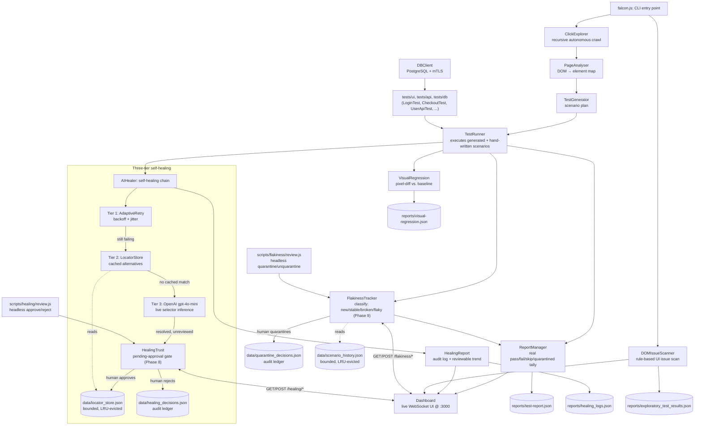

# Falcon-Automation: Self-Healing Test Automation with AI-Assisted Locator Recovery

> **Status:** Active development · Phases 1–12 merged. Phase 10 covers every page of an app in one run; Phase 11 heals every action type; Phase 12 makes healing state and flaky decisions survive CI via cached state files. Phase 13 ("Decisions that can't rot") is in progress on branch `phase-13/decisions-cant-rot`. See [Roadmap](#roadmap) for what's next, [docs/PHASE-PLANS.md](docs/PHASE-PLANS.md) for the detailed plans behind it, and [CHANGELOG.md](CHANGELOG.md) for the full per-bug engineering history.

---

## Why Falcon exists

If you've run a QA team, you already know this story. You've probably lived it this week.

A designer ships a "small" redesign. Nothing about the actual product logic changed: a button moved, a class name got renamed, a `<div>` grew a wrapper it didn't have yesterday. And by the next morning, a third of your suite is red. Not because the product broke. Because a locator did. So instead of testing anything, your team spends the day doing the least valuable work in software: hunting through the DOM for whatever the "Submit" button is called today and swapping one string for another, across a dozen files, in a suite nobody's touched in months because everyone's afraid of what else might be stale in there.

Do that enough times and something worse than lost hours happens: people stop trusting the red. A failing build used to mean "something's broken." After enough selector-drift false alarms, it starts meaning "probably just the tests again, check it later." And the day it's a real bug, it ships anyway, because everyone's learned to shrug at red.

Meanwhile the actual backlog (the new features, the new pages, the new flows nobody has *any* coverage for yet) just keeps growing, because there's no time left to write new tests when all the time goes to nursing the old ones.

This is the real bottleneck in QA. It was never that testing is hard. It's that *maintaining* tests costs more than writing them did, and that cost compounds every single sprint.

Falcon was built to remove that tax, not paper over it. Not a bigger locator library, not a smarter list of fallback selectors somebody has to keep updating by hand. Instead, an engine that behaves the way a good manual tester actually does when a button moves: try again, remember what worked before, and if neither of those lands, actually look at the page and figure out where the thing went. Three tiers, in that exact order, and the third one is a real, live call to an LLM, not a hardcoded map dressed up as "AI."

The rest of Falcon follows from that same instinct. If tests shouldn't need constant hand-holding to survive a redesign, they also shouldn't need to be hand-written in the first place for every new page, so Falcon crawls the app itself, reads the live DOM, and generates the test plan. If a report says "passed," that needs to be true, not aspirational, so every result is a real pass/fail/skip tally, not a hopeful default. And if your team is going to trust an AI-healed selector in production, you need to be able to see exactly what it healed and why, and approve it yourself, not take it on faith. The same goes for a red build: before you quarantine it, you need to know whether it's actually broken or just unreliable, not guess.

## ⚠️ Safety Requirements

**Falcon autonomously clicks links and buttons and fills form controls during discovery.** `ClickExplorer` clicks several elements per page, and `--allow-cross-origin` widens that further. Always run Falcon against a **staging, test, or otherwise disposable environment** — never production. An unreviewed AI-inferred selector can click a real element, which in a real application could delete data, submit a payment, or publish content.

**What that looks like in practice:**

- **UI automation** via Playwright — Chromium is continuously validated in CI; Firefox and WebKit are supported at the `BrowserManager` level but not covered by CI
- **Three-tier self-healing, on every action:** direct attempt (AdaptiveRetry) → LocatorStore → LLM inference (gpt-4o-mini), for clicks, form fills and dropdown selections alike
- **Whole-app coverage:** one command sweeps every page it discovers, bounded by a page cap and a time budget, deduplicating shared navigation and reporting every page it did *not* cover, with a reason
- **Autonomous UI exploration:** recursive crawler (ClickExplorer) + rule-based DOM issue scanning (DOMIssueScanner)
- **DOM-driven interaction generation:** PageAnalyser maps the DOM; TestGenerator creates scenarios; TestRunner executes them with full healing
- **AI-assisted locator recovery:** when an interaction's selector fails, Tier 3 (gpt-4o-mini) infers a replacement and a human approves it before reuse
- **Visual regression testing:** pixel-level screenshot comparison with diff images and cumulative summary
- **Real-time live dashboard:** express + socket.io stream every test event to a browser UI at `localhost:3000`
- **Accurate reporting:** structured pass/fail/skip tallying + Allure HTML report via `allure-playwright`
- **Database testing:** PostgreSQL via `pg` Pool with full mTLS support
- **CI/CD ready:** GitHub Actions pipeline with Allure report upload

**Delivered so far:** core healing + reporting foundation → a stability audit (14 defects fixed) → visual regression, live dashboard, DOM-driven test generation, and Allure reporting → repository hygiene → a single consolidated self-healing engine with a bounded LocatorStore → real Postgres coverage in CI → a token-gated dashboard → a comprehensive regression layer (491 `node:test` cases and 43 Playwright browser tests across two CI jobs) and a real selector-anchoring fix in `PageAnalyser` → an approval gate for AI-inferred selector fixes, so a Tier 3 guess is reviewed by a human before it's ever trusted again → flaky-test detection and quarantine, so a genuinely unreliable interaction stops blocking CI without ever being silently hidden → whole-app coverage, so one run sweeps every page it finds instead of only the one you named → healing state and flaky decisions that survive CI via cached state files. Every defect behind these milestones, with root cause and fix, is in [CHANGELOG.md](CHANGELOG.md). See [Roadmap](#roadmap) for what's next.

---

## Demo

One command, no hand-written test code: Falcon loads a site, crawls it, turns what it finds into test scenarios, executes them with self-healing, and streams every step to a live dashboard as it happens. This is one demo, one site, start to finish.

### Watch it run: a recorded UI test against the live site


That is a real Chromium, a real third-party site, and no editing. The test hands Falcon `#news-search` — an id that does not exist anywhere on the page, which is exactly what an old test suite is left holding after somebody refactors the markup. Tier 1 spends about ten seconds genuinely exhausting its retries against it (the page sits still because nothing can resolve), Tier 2 supplies the alternative it learned earlier, and the value lands in the real, React-wired search field. The proof is the last two seconds: the feed collapses to the one article that matches. Nothing was stubbed and no `OPENAI_API_KEY` was involved — Tier 2 needs neither, which is why it's the tier on camera.

The full recording of all six tests is [`docs/demo/axonradar-ui-test.mp4`](docs/demo/axonradar-ui-test.mp4) (GitHub won't play it inline; download or open it from the file view).

| # | Test | What has to be true for it to pass | Duration |
|---|---|---|---|
| 1 | Every route in the primary navigation loads | All 11 routes read off the live nav return 200 and render a heading. The route list is read from the page, not hardcoded, so a route the site adds is covered automatically | 7.1s |
| 2 | Searching the feed narrows it to real matches | Every card still on screen contains the query; a query nothing matches produces the empty state and zero cards; clearing it brings the feed back | 1.5s |
| 3 | A category chip filters to that category only | The headline set changes *and* every remaining card carries the Robotics kicker — a chip that reorders without filtering passes a count check and fails this | 1.8s |
| 4 | The comparator renders a column per model | A model the table isn't already showing is selected, its column appears, and the comparison rows survive | 0.7s |
| 5 | **Self-healing a `type`:** a stale selector still fills the real field | Tier 1 exhausts, Tier 2 resolves, the live feed filters, the field holds the value, and `HealingReport` records it as one Tier 2 repair of a `type` | 10.8s |
| 6 | **Self-healing a `select`:** a stale selector still drives the real dropdown | Same chain, ending in the comparison table growing the column. This is the case that was silently `skipped` before Phase 11 | 9.9s |

```sh
npm run test:demo                 # headless, records a video per test
HEADLESS=false npm run test:demo  # watch it happen in a visible browser
npm run demo:record               # run it, then rebuild the GIF and MP4 above
```

Last measured run: **6 passed in 32.5s**. The suite is deliberately **not** in CI — it depends on a third-party site staying up and on real network timing, and gating merges on somebody else's deploy is how a pipeline becomes noise. `playwright.config.js` ignores `tests/demo/` for the same reason, so a routine `npx playwright test` never reaches it. The spec is [`tests/demo/axonradar.ui.spec.js`](tests/demo/axonradar.ui.spec.js); its config, including `video: "on"`, is [`playwright.demo.config.js`](playwright.demo.config.js).

### Real-world case study: a live site Falcon had never seen before

A demo against a fixture built for exactly this kind of test doesn't prove much. So instead, everything below comes from pointing Falcon at a real, independently-built, publicly deployed product it had no prior knowledge of: [axonradar.netlify.app](https://axonradar.netlify.app/) (a TypeScript AI-intelligence platform, [source](https://github.com/eddieir/AI-agency)). No config, no fixtures, no hints about the site's structure. Just its 11 real pages (`/`, `/news`, `/models`, `/benchmarks`, `/playground`, `/evaluations`, `/router`, `/operations`, `/developers`, `/creators`, `/compare`), run through the same explore, generate, heal pipeline and streamed to one live dashboard:

```sh
node falcon.js --url=https://axonradar.netlify.app --max-pages=11
```


**184 scenarios generated across 11 pages. 133 passed, 11 failed, 40 deduplicated, 0 skipped. 23 real UI issues found. Exit code 1.**

Every one of those numbers is disclosed as measured, including the unflattering ones. The 40 deduplicated scenarios are shared navigation that repeats on every page, counted rather than hidden. The 11 failures are almost all cases where Tier 1 and Tier 2 healing genuinely ran out of options and Tier 3 would take over, but this run had no `OPENAI_API_KEY` configured, so Tier 3 never fired. The healing log for the run records **0 selectors actually repaired against 11 attempts that resolved nothing** — Falcon says exactly that in its summary rather than reporting the attempts as successes.

The `0 skipped` is the part worth pausing on. Running the identical command against the previous release gives:

| | before Phase 11 | after Phase 11 |
|---|---|---|
| Total | 184 | 184 |
| Passed | 132 | 133 |
| Failed | 10 | 11 |
| **Skipped** | **2** | **0** |
| Deduped | 40 | 40 |

Those two skips were real and silent — `⏭ Skipping Fill input field: Element is not visible`, twice, on a live site, never reaching the healing chain. They now reach it and resolve into an actual verdict: one passes, one fails honestly. On this particular site the run was red anyway, so nothing was being hidden behind a green build here; the site where those two skips are the *only* problem is the one Phase 11 exists for.

### How it works, one page at a time

The screenshots below zoom in on a single page of that same sweep (the homepage) so you can see the mechanism firsthand, in the order it actually happens: dashboard connects, the crawler explores, scenarios generate and run. `PageAnalyser.generateActions()` caps navigation-type scenarios at 3 per page by design, to avoid infinite click loops, which is why one page alone only produces a handful of scenarios; the total above is what you get when the sweep runs that same mechanism across every page of the site.

To watch it against a single page instead, narrow the sweep:

```sh
node falcon.js --url=https://axonradar.netlify.app --single-page
```


*(Recording generated from a real local run against axonradar.netlify.app; see [`docs/demo/`](docs/demo/) for the source frames and regeneration steps below.)*

**1. Dashboard comes up first**, empty and connected, before any exploration or test scenario runs. This is `Dashboard.start()` completing while `falcon.js` is still navigating to the target URL:


**2. `ClickExplorer` crawls the page** and streams an `explorerPage` event for every page it visits, in real time, over the same socket the dashboard is already listening on:


**3. `PageAnalyser` scans the live DOM, `TestGenerator` turns it into a scenario plan, and `TestRunner` executes it** through the three-tier self-healing chain. Each scenario's pass/fail/heal event lands on the dashboard the instant it happens:


**4. Terminal output for that single page.** No scenario file existed anywhere in the repo for axonradar.netlify.app; everything below was generated from the DOM:

```
🟢 INFO: 🖥  Dashboard → http://localhost:3000
🟢 INFO: 🌍 Navigating to https://axonradar.netlify.app/…
🟢 INFO: ✅ Loaded: https://axonradar.netlify.app/
🟢 INFO: 🔍 Step 1: Detecting UI issues with DOMIssueScanner…
🟢 INFO: 🔍 Scanning the DOM for rule-based UI issues...
🟢 INFO: 🧐 Rule-based scan flagged 2 potential UI issue(s) — heuristics, may include false positives.
🟢 INFO:   → 2 issue(s) found
🟢 INFO: 🔍 Step 2: Mapping site with ClickExplorer…
🟢 INFO:   → 1 page(s) explored
🟢 INFO: 🔍 Step 3: Generating test scenarios from DOM analysis…
🟢 INFO: ✅ [PageAnalyser] Found 66 interactive elements
🟢 INFO:   → 4 scenario(s) generated for https://axonradar.netlify.app/
🟢 INFO: ▶  Step 4: Executing generated test scenarios (repeat=1)…
🟢 INFO: ▶ Executing [1/1]: Click RESCAN ↻ (click)
🟢 INFO: 🔹 Tier 1: Trying Click RESCAN ↻ (html:nth-of-type(1) > body:nth-of-type(1) > main:nth-of-type(1) > section:nth-of-type(4) > div:nth-of-type(2) > div:nth-of-type(1) > button:nth-of-type(1))
🟢 INFO: ✅ Passed: Click RESCAN ↻ (59ms)
🟢 INFO: ▶ Executing [1/1]: Navigate: AXON//RADAR (click)
🟢 INFO: ✅ Passed: Navigate: AXON//RADAR (30ms)
🟢 INFO: ▶ Executing [1/1]: Navigate: News (click)
🟢 INFO: ✅ Passed: Navigate: News (31ms)
🟢 INFO: ▶ Executing [1/1]: Navigate: Models (click)
🟢 INFO: ✅ Passed: Navigate: Models (37ms)
🟢 INFO: 🛠 Writing exploratory scan summary...
🟢 INFO: 📊 Exploratory Test Summary:
🟢 INFO: ❗ UI Issues Found:  2
🟢 INFO: 🌍 Pages Explored:  1

✅ Test Run Complete: PASSED
   Total: 4  |  Passed: 4  |  Failed: 0  |  Skipped: 0
   Duration: 4.61s
   UI Issues detected: 2
   Report written to: reports/test-report.json
```

Those 2 UI issues aren't fabricated, but they illustrate the limits of rule-based heuristics. `DOMIssueScanner` flagged the site's mobile menu button as a known false positive: a hidden element with `innerText` empty (`<button aria-label="Open menu" class="menu-toggle"><span></span><span></span></button>`). The element **does** have an accessible label, and a menu button hidden at desktop width is behaving as designed. The rule checks only `innerText`, not accessible names, so this exact false positive recurs. The 23 UI issues flagged across all 11 pages are heuristic findings, not confirmed defects — a human reviewer can distinguish real problems from expected behavior. This is why `DOMIssueScanner` reports them as "potential" issues and notes that heuristics may include false positives.

### Self-healing, demonstrated against the same real site

The full sweep above didn't happen to hit a genuinely broken selector, so the healing chain is exercised the same way a real front-end refactor would trigger it: a selector that's never existed on this site (`#rescan-trigger-legacy`, standing in for a renamed id) with `LocatorStore` pre-seeded with the real, current selector for the same element, exactly as a prior successful Tier 3 (LLM) healing run would have taught it:

```
🔹 Tier 1: Trying RESCAN (#rescan-trigger-legacy)
⚠️ Attempt 1 failed for "RESCAN" [TIMEOUT]: page.waitForSelector: Timeout 2000ms exceeded.
⏳ Waiting 1128ms before retry...
🔹 Tier 1: Trying RESCAN (#rescan-trigger-legacy)
⚠️ Attempt 2 failed for "RESCAN" [TIMEOUT] ...
⏳ Waiting 1870ms before retry...
🔹 Tier 1: Trying RESCAN (#rescan-trigger-legacy)
⚠️ Attempt 3 failed for "RESCAN" [TIMEOUT] ...
❌ Tier 1 exhausted for RESCAN. Engaging Tier 2/3 healing.
🔹 Trying stored alternative: button:has-text('RESCAN')
✅ Healed and clicked "#rescan-trigger-legacy" via the real selector, with zero code changes to any test.
```

Tier 1 genuinely exhausts its 3 retries with real exponential backoff (not a mocked delay) against the real page before falling back. Reproduce it yourself: `node docs/demo/self-heal-axonradar-demo.js`.

### Healing trust, demonstrated against the same real site

A Tier 2 fix (above) was already reviewed once, which is how it got into `LocatorStore` in the first place, so it's reused immediately. A Tier 3 fix is different: an LLM guess that's never been looked at by anyone. The inferred selector **is executed in the current run** — a click clicks, a fill fills — but **it is not persisted** until a human approves it. Below, the same site is hit with a selector that has no cached fix at all, so Tier 1 and Tier 2 both genuinely fail and Tier 3 is asked. The LLM call itself is stubbed (see [`docs/demo/healing-trust-axonradar-demo.js`](docs/demo/healing-trust-axonradar-demo.js) for why), but everything downstream, the real click, the pending-review entry, the approval gate, and the persisted `LocatorStore` write, is the real code path. The consequence: an unreviewed inference can click a real element in the current run, which is why Falcon should run only against staging or test environments, never production:

```
=== Step 1: a selector breaks with no cached fix. Tier 1 and Tier 2 both fail, so Tier 3 is asked ===
🔹 Tier 1: Trying RESCAN (#rescan-trigger-v2-renamed)
❌ Tier 1 exhausted for RESCAN. Engaging Tier 2/3 healing.
🤖 Asking AI to infer locator for: #rescan-trigger-v2-renamed
🤖 AI suggested: button:has-text('RESCAN')
Tier 3 clicked the right element via "button:has-text('RESCAN')".

=== Step 2: prove it was NOT silently trusted. LocatorStore has nothing for it yet ===
LocatorStore.getAlternatives("#rescan-trigger-v2-renamed") -> []
Empty, as expected: a working guess earns no automatic trust.

=== Step 3: it is sitting in review instead ===
{
  "original": "#rescan-trigger-v2-renamed",
  "suggested": "button:has-text('RESCAN')",
  "description": "RESCAN",
  "occurrences": 1
}

=== Step 4: a human reviews it and approves. Only now does it become a trusted Tier 2 alternative ===
LocatorStore.getAlternatives("#rescan-trigger-v2-renamed") -> ["button:has-text('RESCAN')"]
On the next run, Tier 2 handles this selector at zero LLM cost.
```

Until that approval happens, the exact same broken selector pays the Tier 3 LLM cost again on every subsequent run, on purpose: a guess earns no trust just because it worked once. Review and approve pending fixes either from the live dashboard's "Healing trust" panel, or headlessly:

```sh
node scripts/healing/review.js list                        # what's awaiting review
node scripts/healing/review.js approve "<original-selector>"
node scripts/healing/review.js reject  "<original-selector>"
```

Reproduce the demo above yourself: `node docs/demo/healing-trust-axonradar-demo.js`.

### What Tier 3 sends to OpenAI

Tier 3 sends a targeted DOM snapshot to `gpt-4o-mini` (temperature 0), not the full page. The snapshot includes all interactive elements (`input, button, a, select, textarea, label, [data-testid], [aria-label]`), serializing each element's tag name and **all of its HTML attributes**, then truncating to 6,000 characters. Element labels, IDs, test IDs, names, classes, URLs, and button text in that snapshot leave your network. Non-password attributes are sent as-is; password-field `value` attributes are specifically stripped. This means readable content and structural hints reach OpenAI to help the model find the right element. Tier 3 requires `OPENAI_API_KEY` to be set and does not fall back to lower tiers if the key is missing — it simply does not run, so Tier 3 is effectively opt-in. A run with no API key still passes Tiers 1 and 2; it just never reaches the LLM.

### Healing every action, demonstrated against the same real site

The two sections above heal a *click*. Until Phase 11 that was the only action Falcon could heal: a `type` or `select` whose locator broke was marked `skipped` before the healer was ever consulted, and a skip doesn't fail a run. A renamed input id cost you coverage and left the build green.

Below, two real controls on the live site have their locators broken the way a deploy between analysis and execution breaks them — the `/news` search field, and the second model dropdown on `/compare`. Neither element carries an id, a name, or a `data-testid`, so the plan holds a structural selector, which is exactly what a front-end refactor invalidates. The LLM call itself is stubbed (there is no API key in this environment, and the script says so in its own output); everything downstream is the real code path:

```
=== Scenario 1: /news — search input's locator breaks between plan and run (type) ===
✓ PageAnalyser plans "input" for the /news search field (got "input")
✓ the real search field is uniquely findable by its placeholder (count=1)
❌ Tier 1 exhausted for News search field. Engaging Tier 2/3 healing.
🤖 Asking AI to infer locator for: input
  [stubbed LLM] would infer: input[placeholder="Search headline, body, or source"]
Read back from the live field: "quantum computing"
✓ the typed text actually landed in the real /news search field
✓ Tier 1 genuinely failed and Tier 3 genuinely resolved this — not a disguised Tier 1 pass (tier=LLM)

=== Scenario 2: /compare — second model dropdown's locator breaks between plan and run (select) ===
✓ the plan selector resolves to exactly one element before the mutation (count=1)
❌ Tier 1 exhausted for Compare model 2 dropdown. Engaging Tier 2/3 healing.
Read back from the live dropdown: "kimi-k2-6"
✓ the option actually changed in the real /compare dropdown
✓ Tier 1 genuinely failed and Tier 3 genuinely resolved this — not a disguised Tier 1 pass (tier=LLM)

=== Scenario 3: neither fix was silently trusted — Phase 8's gate applies to type/select too ===
LocatorStore.getAlternatives("input") -> []
✓ LocatorStore has nothing for the healed input selector (a guess earns no automatic trust)
✓ the type fix is sitting in HealingTrust as pending review
✓ the select fix is sitting in HealingTrust as pending review
```

The value is read back out of the live page in both cases, because a `passed` line proves nothing on its own: a healed fill that reports success without filling anything would be worse than the failure it replaced. The healing record now carries the action it repaired (`"action":"type"`, `"action":"select"`), and the Phase 8 trust gate applies unchanged — an LLM guess for a form field waits for a human exactly as one for a button does.

Reproduce it yourself: `node docs/demo/phase-11-heal-every-action-demo.js`.

### Exit codes that mean what they say

Every guarantee above is worth nothing if the process exits 0 regardless. This demo spawns each case as a real child process and compares the reported result against the exit code the operating system actually saw:

```
case                              reported      claimed  observed  match
every scenario passed             PASSED        0        0         yes
one real failure among passes     PARTIAL       1        1         yes
a failure a human quarantined     PASSED        0        0         yes
Phase 11: every scenario skipped  NO_TESTS_RUN  1        1         yes
Phase 10: every scenario deduped  NO_TESTS_RUN  1        1         yes
no scenarios at all               NO_TESTS_RUN  1        1         yes
```

The fourth and fifth rows are the interesting ones. Work that never ran cannot be a pass: a run made entirely of skipped or deduplicated scenarios verified nothing, and now exits 1 exactly as an empty run does. Before Phase 10 and Phase 11 respectively, both of those reported PASSED.

Reproduce it yourself: `node docs/demo/honest-exit-code-demo.js`.

### Flaky-test detection, demonstrated against the same real site

The same interaction, run repeatedly against the real page, sometimes passes and sometimes fails, exactly the way a genuinely timing-sensitive element behaves in a real suite. Below, `FlakinessTracker` watches six real `TestRunner` runs of the same scenario, classifies it, and a human quarantines it so it stops blocking CI without the instability ever being hidden:

```
=== Step 1: run the exact same scenario 6 times against the real page ===
run 1: element present -> passed
run 2: element removed -> failed
run 3: element present -> passed
run 4: element present -> passed
run 5: element removed -> failed
run 6: element present -> passed

=== Step 2: FlakinessTracker classifies "Flaky Target" from that real history ===
{
  "classification": "flaky",
  "flakeRate": 0.33,
  "sampleSize": 6,
  "history": ["passed", "failed", "passed", "passed", "failed", "passed"]
}

=== Step 3: a human reviews it and quarantines it ===
Quarantined by "demo-script".

=== Step 4: run it again with the element removed. It fails again, but now reports "quarantined", not "failed" ===
status: quarantined

=== Step 5: ReportManager still reports PASSED: a quarantined failure never blocks the run ===
✅ Test Run Complete: PASSED
   Total: 1  |  Passed: 0  |  Failed: 0  |  Skipped: 0  |  Quarantined: 1
```

Nothing about this is a separate, simplified code path: every run above is a real `TestRunner.executeTest()` call, `ReportManager` is the same one every scenario test file uses, and quarantining changes only how a failure is *reported*, never whether the interaction actually passed or failed. Review flaky scenarios and quarantine/unquarantine them either from the live dashboard's "Flaky tests" panel, or headlessly:

```sh
node scripts/flakiness/review.js list                       # every tracked scenario
node scripts/flakiness/review.js list flaky                 # or filter: new | stable | broken | flaky
node scripts/flakiness/review.js quarantine "<scenario-key>"
node scripts/flakiness/review.js unquarantine "<scenario-key>"
node scripts/flakiness/review.js rehab                       # rehabilitation candidates (Phase 13)
```

The same demo ends by showing what quarantine will *not* do. A scenario that has failed every time it has ever run is refused outright:

```
=== Step 6: a scenario that has failed every single time cannot be quarantined at all ===
Refused: quarantine() threw code "QUARANTINE_REFUSED"

=== Step 7: the same scenario becomes quarantinable the moment it genuinely passes once ===
```

That is a regression, not flakiness, and quarantining it would turn a genuinely red run green. The rule is "has passed at least once", not "isn't classified `broken`" — a scenario that has only ever failed twice is still classified `new`, because two samples are under the verdict threshold, and hiding that would be just as effective a way to lose a real failure. There is no force flag anywhere.

Reproduce the demo above yourself: `node docs/demo/flaky-test-detection-demo.js`.

### Visual regression, demonstrated against the same real site

A real baseline screenshot of the live page, compared against itself (0 px changed), then compared again after a real DOM change was injected (a "MAINTENANCE MODE" banner) and caught:

```
✅ [VisualRegression] "axonradar-home" passed: 0 px changed (0.00%)
❌ [VisualRegression] "axonradar-home" FAILED: 62007 px changed (0.49% > threshold 0.1%)
```

Reproduce it yourself: `node docs/demo/visual-regression-axonradar-demo.js`.

**Why this matters for evaluating Falcon:** this is a site Falcon's authors did not build, did not tune selectors for, and had no advance knowledge of. It's the actual bar a QA team would need it to clear, exercised across every page of the product, not a cherry-picked golden path.

### Try it against your own app

No fixture required, just a URL:

```sh
node falcon.js --url=https://your-app.example.com
```

### Regenerating this demo

The recordings above aren't hand-drawn. They're real frames captured from a live `node falcon.js` run with Playwright, assembled with `ffmpeg`. Frame timing depends on real network/render latency, so a fixed frame index (e.g. "frame 6 is always the explore state") silently goes stale between runs. `docs/demo/build-gif-list.js` instead hashes every captured frame, collapses consecutive duplicates, and keeps one frame per *actual* dashboard state change, whatever real time that landed at:

```sh
# 1. Start the run and the capture together. Waiting for the dashboard to
#    answer before starting the capture lets a short run finish first — the
#    empty and explore states are then already gone. capture-dashboard.js
#    waits for the port itself, so both start at once.
node falcon.js --url=https://axonradar.netlify.app &

# 2. Capture frames with Playwright while the run streams events
#    (frameCount, intervalMs, output directory under docs/demo/)
node docs/demo/capture-dashboard.js 60 120 frames-axonradar
wait

# 3. Pick one frame per real state change (connect / explore / results)
node docs/demo/build-gif-list.js docs/demo/frames-axonradar docs/demo/axonradar-gif-list.txt 3.0

# 4. Assemble into a GIF
cd docs/demo
ffmpeg -y -f concat -safe 0 -i axonradar-gif-list.txt \
  -vf "fps=10,scale=900:-1:flags=lanczos,split[s0][s1];[s0]palettegen[p];[s1][p]paletteuse" \
  falcon-axonradar-demo.gif
```

`docs/demo/capture-dashboard.js` and `docs/demo/build-gif-list.js` are checked in so this is reproducible against any future run, not a one-off screenshot. The full-sweep, self-healing, healing-trust, flaky-detection, and visual-regression sections above are each their own standalone, reproducible script:

```sh
# Full 11-page sweep, real aggregate totals streamed to the live dashboard
node docs/demo/multi-page-axonradar-dashboard-demo.js

# Self-healing: Tier 1 exhausted -> Tier 2 healed, against a real element
node docs/demo/self-heal-axonradar-demo.js

# Healing trust: Tier 3 succeeds but isn't trusted until a human approves it
node docs/demo/healing-trust-axonradar-demo.js

# Flaky-test detection: the same interaction, genuinely nondeterministic, quarantined —
# and a scenario that has never passed being refused quarantine outright
node docs/demo/flaky-test-detection-demo.js

# Visual regression: a real baseline vs. a genuine injected change
node docs/demo/visual-regression-axonradar-demo.js

# Healing on every action: a real search field and a real dropdown whose locators
# break between analysis and execution, healed through the same three tiers
node docs/demo/phase-11-heal-every-action-demo.js

# Exit-code honesty: every reported result checked against the real process exit code
node docs/demo/honest-exit-code-demo.js
```

The recorded UI test at the top is rebuilt the same way, from the videos Playwright records rather than from a screen capture:

```sh
npm run demo:record
```

`docs/demo/build-ui-test-recording.js` finds each video through `reports/ui-demo-results.json` rather than by walking the artefact directory — Playwright names those directories after a truncated, hashed form of the test title, so matching on the directory name silently stops working the first time a title is edited. Reading the reporter's JSON also means the script can see each test's status, and it refuses to write either file if any test failed or any video is missing. A recording is published as evidence the suite works; one built from a red run would be evidence of nothing. Needs `ffmpeg` on `PATH`.

Each one exits non-zero if its own assertions fail, so a demo cannot quietly succeed while the mechanism behind it is broken.

---

## Architecture



The pipeline has two entry paths that converge on the same healing engine: the **autonomous path** (`falcon.js`: explore, generate, and run scenarios with no hand-written test code) and the **explicit path** (hand-written scenario files under `tests/`). Both go through the identical `AIHealer` three-tier chain, so a selector fix learned by one path benefits the other via the shared `LocatorStore`, once it's been through the `HealingTrust` approval gate described below.

---

## Project Structure

```
Falcon-Automation/
├── .github/workflows/
│   └── ci.yml                       # GitHub Actions pipeline (see CI/CD)
├── src/
│   ├── config/
│   │   └── testConfig.json          # ConfigManager's JSON config source
│   ├── dashboard/
│   │   └── index.html               # Live dashboard front-end (socket.io client)
│   └── core/
│       ├── AIHealer/
│       │   ├── AIHealer.js          # Three-tier self-healing engine (Tier 3: OpenAI)
│       │   ├── HealingReport.js     # Audit log for all healing events + reviewable trend (summary())
│       │   ├── HealingTrust.js      # Tier 3 approval gate: pending review -> approve/reject (Phase 8)
│       │   ├── LocatorStore.js      # Persisted alternative locators (Tier 2 cache, bounded)
│       │   ├── AdaptiveRetry.js     # Tier 1: backoff + jitter retry
│       │   └── AIAnalyser.js
│       ├── APIClient.js             # HTTP client used by tests/api/*.js
│       ├── BaseTest.js              # Dependency-injection base class
│       ├── BrowserManager.js        # Playwright wrapper (chromium/firefox/webkit)
│       ├── ClickExplorer.js         # Recursive autonomous crawler
│       ├── ConfigManager.js         # JSON + env config singleton
│       ├── Dashboard.js             # express + socket.io live dashboard server
│       ├── DBClient.js              # PostgreSQL pool with mTLS support
│       ├── ErrorHandler.js
│       ├── DOMIssueScanner.js       # Rule-based DOM issue scanner (heuristic findings, may include false positives)
│       ├── FlakinessTracker.js      # Pass/fail history, classification, quarantine gate (Phase 9)
│       ├── Middleware.js            # Lifecycle hooks + cross-process event emit
│       ├── PageAnalyser.js          # DOM scanner (single source of truth; see CHANGELOG.md#phase-3--competitive-features)
│       ├── ReportManager.js         # Accurate pass/fail/skip/quarantined reporting, sets process.exitCode
│       ├── ServiceContainer.js      # Partial DI container (browserManager, apiClient, dbClient, reportManager)
│       ├── SiteSweep.js             # Whole-app sweep: bounded frontier, dedupe, coverage accounting (Phase 10)
│       ├── TestGenerator.js         # Delegates to PageAnalyser for scenario generation
│       ├── TestRunner.js            # Scenario + exploratory test orchestrator
│       └── VisualRegression.js      # Pixel-diff screenshot comparison
├── tests/
│   ├── ui/                          # LoginTest, CheckoutTest, GoogleSearchTest
│   ├── api/                         # UserApiTest, ProductApiTest
│   ├── db/                          # UserDBTest, OrderDBTest, TestDBConnection
│   ├── unit/                        # Fast regression checks: no browser, no DB
│   │   ├── ReportManagerExitCode.check.js
│   │   ├── DBConfigBehavior.check.js
│   │   └── DashboardAuth.check.js
│   ├── regression/                  # The node:test + Playwright regression layer
│   │   ├── *.check.cjs              # node:test suites, one per module area
│   │   ├── browser.spec.js          # Playwright specs against inline HTML fixtures
│   │   └── helpers.cjs              # Module loader with injectable dependencies
│   ├── demo/                        # The recorded UI suite: real browser, live
│   │   └── axonradar.ui.spec.js     # third-party site, not in CI (npm run test:demo)
│   ├── fixtures/                    # Shared test fixtures (cli-preload.cjs)
│   └── full_automation.test.js      # Playwright-native suite (allure-playwright reporter)
├── scripts/
│   ├── db/
│   │   └── ci-seed.sql              # Minimal schema/seed applied to CI's Postgres
│   ├── healing/
│   │   └── review.js                # Headless list/approve/reject CLI for pending healing fixes
│   └── flakiness/
│       └── review.js                # Headless list/quarantine/unquarantine CLI for flaky scenarios
├── utils/
│   └── Logger.js                    # Async file logging (non-blocking)
├── data/                            # Gitignored
│   ├── locator_store.json           # Persisted LocatorStore entries (Tier 2, bounded)
│   ├── healing_pending.json         # Tier 3 fixes awaiting human review (Phase 8)
│   ├── healing_decisions.json       # Approved/rejected audit ledger (Phase 8)
│   ├── scenario_history.json        # Per-scenario pass/fail history, bounded (Phase 9)
│   ├── quarantine_decisions.json    # Quarantine/unquarantine audit ledger (Phase 9)
│   └── *.corrupt-*-*-*              # Recovered corrupted state files (Phase 12, manual cleanup)
├── reports/                         # Generated at runtime (gitignored)
│   ├── execution.log
│   ├── test-report.json
│   ├── exploratory_test_results.json
│   └── healing_logs.json
├── playwright.config.js             # Playwright native-suite config
├── falcon.js                        # Main entry point (autonomous pipeline)
├── package.json
├── .env.example                     # Template: copy to .env
└── .env                             # Local secrets (not committed)
```

---

## Installation

### 1. Clone

```sh
git clone https://github.com/eddieir/Falcon-Automation.git
cd Falcon-Automation
```

### 2. Install dependencies

Requires **Node 20.19+** (declared in `package.json`'s `engines` field). The regression suite's `node:test` scripts (`test:regression`, `test:coverage`) use flags that don't exist on older Node builds.

```sh
npm install
npx playwright install chromium firefox webkit
```

### 3. Configure environment variables

Copy the template and fill in your values:

```sh
cp .env.example .env
```

```ini
# Browser
BROWSER=chromium           # chromium | firefox | webkit
HEADLESS=true               # true for CI; false to watch the browser locally

# OpenAI: optional, enables Tier 3 AI healing. Every call site degrades
# gracefully when this is unset; Tier 3 just never fires.
OPENAI_API_KEY=

# API base URL: optional, defaults to jsonplaceholder
API_BASE_URL=https://jsonplaceholder.typicode.com

# Live dashboard: optional
DASHBOARD_PORT=3000         # port for `node falcon.js`'s live dashboard
DASHBOARD_LINGER_MS=60000   # how long the dashboard stays up after a run finishes
# DASHBOARD_URL=http://localhost:3000  # set on a standalone test run (e.g.
                                        # `node tests/ui/LoginTest.js`) to report
                                        # its events into an already-running dashboard

# PostgreSQL: required only for DB tests. Leave DB_HOST/DB_USER blank to
# skip tests/db/*.js cleanly. Don't fill these in with placeholder text,
# DBClient only checks for truthiness, so a non-empty placeholder is treated
# as "configured" and it'll try to connect instead of skipping.
DB_HOST=
DB_PORT=5432
DB_USER=
DB_PASS=
DB_NAME=
DB_SSL=false                # set to true only if your Postgres requires TLS

# SSL/mTLS: only needed when DB_SSL=true and using client certs
# SSL_CA_FILE=./certs/ca.pem
# SSL_KEY_FILE=./certs/client.key
# SSL_CERT_FILE=./certs/client.crt
# SSL_REJECT_UNAUTHORIZED=true
```

---

## Self-Healing Architecture

Falcon's healing engine operates in three tiers, in order:

| Tier | Mechanism | API cost | Speed |
|------|-----------|----------|-------|
| 1 | Direct selector attempt (3 retries, 2 s timeout each) | None | Fast |
| 2 | LocatorStore: alternatives learned from prior runs | None | Fast |
| 3 | LLM inference: live DOM snapshot + OpenAI gpt-4o-mini | ~$0.001/call | ~1-2 s |

Every supported action goes through that chain, not just clicks. A renamed input or a restructured dropdown is healed exactly as a renamed button is, and Tiers 2 and 3 perform the *real* interaction against the resolved selector — a fill fills, a select selects. Healing a form field by clicking it would report a pass for something that never happened, which is worse than the failure it was hiding. Every healing record notes which action was healed, so the audit trail distinguishes a repaired click from a repaired form fill.

A successful Tier 2 match was already reviewed once (it's how it got into `LocatorStore` in the first place) and is reused immediately. A successful Tier 3 result is different: nobody has looked at it yet. It does not get written to `LocatorStore` automatically. Instead it goes to `HealingTrust` as a fix awaiting human review, and the exact same broken selector pays the Tier 3 cost again on every subsequent run until a human approves it. "Self-healing" should never mean "silently trusted": an LLM guess earns reuse rights by being reviewed, not by having worked once.

The healing engine captures a targeted DOM snapshot (interactive elements only, ≤ 6 KB) rather than the full page, keeping inference prompts small and latency predictable.

`AIHealer` is now the single healing implementation used by every entry point (`LoginTest`, `CheckoutTest`, `GoogleSearchTest`, etc.). The older, parallel `SelfHealingManager` path (and its sole caller, `LoginPage.js`) has been removed. `LocatorStore` also tracks a `lastUsed` timestamp per selector and is bounded: at most 5 alternatives are kept per selector and at most 500 distinct selectors are tracked overall, with the least-recently-used entries evicted first, so `data/locator_store.json` can't grow without limit across a long project history.

### Healing trust: reviewing and approving Tier 3 fixes (Phase 8)

Every healing attempt, across all three tiers, is already recorded by `HealingReport`. Beyond the flat event log, `HealingReport.summary()` aggregates it into a reviewable trend, one row per selector, showing how many times it broke, which tiers resolved it and how often, and its most recent outcome, instead of an unreadable list of individual events.

A pending Tier 3 fix can be reviewed and decided on two ways:

- **The live dashboard's "Healing trust" panel** (`localhost:3000`, or wherever `DASHBOARD_PORT` points): lists every fix awaiting review with its suggested replacement, description, Tier 3 invocation count, and rejection history (if any), with **Approve**/**Reject** buttons. Backed by `GET /healing/pending`, `GET /healing/trend`, `POST /healing/approve`, and `POST /healing/reject`, gated by the same `DASHBOARD_TOKEN` and rate limiter as `/emit` and `/events`.
- **`scripts/healing/review.js`**, for headless environments where the dashboard isn't open:

  ```sh
  node scripts/healing/review.js list                        # what's awaiting review (shows rejection history)
  node scripts/healing/review.js approve "<original-selector>"
  node scripts/healing/review.js reject  "<original-selector>"
  node scripts/healing/review.js approve-all
  ```

Approving writes the fix into `LocatorStore` (Tier 2 reuses it from then on) and records the decision in `data/healing_decisions.json`. Rejecting discards it, never touching `LocatorStore`, but keeps the same audit record so a rejected guess doesn't quietly get re-suggested with no memory of having been turned down. Rejection memory carries a count and timestamps; when the same selector-suggestion pair is proposed again, the history is flagged so a human can see it was previously rejected. Both `data/healing_pending.json` and `data/healing_decisions.json` are gitignored, the same as `locator_store.json`.

---

## State Durability and Recovery (Phase 12)

Falcon's decision ledgers and scenario history are persisted across runs. To ensure an interrupted write cannot truncate a file, all four state files (`scenario_history.json`, `quarantine_decisions.json`, `healing_pending.json`, `healing_decisions.json`) are now written to a temporary file in the same directory and renamed into place, making the write atomic at the filesystem level.

If a state file cannot be parsed (corrupt JSON), Falcon logs a warning naming the file, preserves the original bytes beside it as `<name>.corrupt-<timestamp>-<pid>-<uuid>`, starts from empty state and continues the run. An existing sidecar is never overwritten. The warning does not include the parser's own message to avoid quoting file contents in logs.

When you see a `.corrupt-*` file appear next to a state file, the operator should:
1. Inspect the sidecar to understand what was lost or corrupted
2. Manually recover any critical decisions (e.g., re-quarantine a scenario if its decision was lost)
3. Delete the sidecar deliberately once recovered

A concurrent-write scenario is not supported by the atomic-rename model: two Falcon processes writing the same state file can still lose one another's updates. The supported model is one writer at a time per state file.

---

## Staleness and Rehabilitation (Phase 13)

Falcon creates queues of human decisions: pending healing fixes await review, and quarantined scenarios remain hidden from the build. Neither creates enough urgency on its own, so both can accumulate indefinitely while the framework stays silent about the cost.

Phase 13 makes both visible. A pending fix older than a configurable threshold or a quarantined scenario that has passed its last N runs surfaces in a new review status check, so the queue cannot rot unnoticed.

### Staleness thresholds

Three new optional environment variables, validated at read time (reject invalid values with a clear message naming the setting):

```ini
# How long an unreviewed pending healing fix can sit before it's flagged stale.
# Integer 1-3650 days; default 14. Age measured from the fix's firstSeen.
# Boundary rule: a record exactly ON the threshold is NOT stale.
HEALING_PENDING_STALE_DAYS=14

# How long a flaky, non-quarantined scenario can sit before it's flagged stale.
# Integer 1-3650 days; default 14. Age measured from the scenario's flakySince.
FLAKY_UNREVIEWED_STALE_DAYS=14

# How many consecutive passed results a quarantined scenario needs to surface
# as a rehabilitation candidate (still quarantined, never auto-unquarantined).
# Integer 1-20; default 5. A failure resets the counter.
REHAB_CANDIDATE_WINDOW=5
```

### Review status check

`scripts/review/status.js` reports staleness and surfaces rehabilitation candidates:

```sh
npm run review:status          # soft-warning mode: print findings, exit 0
npm run review:status:strict   # hard-gate mode: print findings, exit 1 if anything stale
node scripts/review/status.js --fail-on-stale  # same as :strict
```

Exit codes:

| Situation | Exit |
|---|---|
| Nothing stale | 0 |
| Something stale, no `--fail-on-stale` flag | 0 (findings printed) |
| Something stale, with `--fail-on-stale` | 1 |
| Invalid configuration (bad env values) | 2 |
| Unrecognized argument | 3 |
| State files missing or empty | 0 |
| State file corrupt (JSON parse error) | 0 (recovered to empty, warned, original preserved as `.corrupt-*`) |

The check accepts exactly one flag, `--fail-on-stale`, and deliberately no flag that takes a path or reads a config file.

### Quarantine rehabilitation

A quarantined scenario whose most recent `REHAB_CANDIDATE_WINDOW` recorded outcomes have all passed is surfaced as a rehabilitation candidate. It remains quarantined (never auto-unquarantined — lifting a quarantine stays an explicit human action), but the candidate shows up:

- In `npm run review:status` output
- In the `flaky:list` command, filtered or unfiltered
- In `node scripts/flakiness/review.js rehab` (read-only subcommand)
- In the dashboard's `GET /flakiness/rehabilitation` route and "Flaky tests" panel

A scenario with fewer than N recorded outcomes is not a candidate. Any failure removes candidacy and resets the counter. `unavailable` (a form field that can't be found) is stored as a failure, so it disqualifies.

### Rejection memory

A pending healing fix now carries `previouslyRejected: { count, lastRejectedAt, lastRejectedBy }`, visible in the CLI and dashboard. When a selector-suggestion pair that was previously rejected is proposed again, the rejection is flagged so a human can see the history.

**Important limitation:** Rejection memory is computed by folding the healing decision ledger, which is now capped at the newest 500 rows. Once a rejection ages out of that window, the pair can be proposed again as if new. This is a deliberate consequence of closing D7 and D9 together with a single source of truth rather than a second store that could disagree — read [CHANGELOG.md](CHANGELOG.md#phase-13) for the trade-off.

### Tier 3 invocation visibility

A pending fix carries `tier3Invocations`, counted at the real Tier 3 call boundary — every call to the selector-inference step, including calls that return nothing or whose healed action then fails. This counter is displayed by `scripts/healing/review.js list` and in the dashboard healing panel.

**Terminology is binding: this is an INVOCATION COUNT, not a cost estimate.** No dollar figure, token count, or pricing data is captured or displayed anywhere. `occurrences` (times re-recorded as pending) and `tier3Invocations` (times Tier 3 was called) are distinct and must never be conflated.

### Bounded state

Both decision ledgers — healing approvals/rejections and quarantine decisions — are now newest-N ring buffers at 500 rows. The pending healing queue is LRU-capped at 200 entries by `lastSeen`. Eviction is logged at `info` level.

Ledgers are capped on load as well as on mutation (migration path for an already-oversized file). The pending queue is never truncated on load — it loads whole and logs a warning if it exceeds the cap, because pending entries are live human work nobody has acted on yet, and are only trimmed when a new fix arrives.

---

## Flaky-Test Detection (Phase 9)

A failing scenario has always been reported as `failed`, full stop, with no way to tell "the app genuinely broke" from "this interaction is just unreliable." That distinction matters: test-maintenance surveys consistently point at flaky tests as one of the fastest-growing sources of wasted QA time, and a team that can't tell the two apart either chases ghosts or, worse, starts ignoring red builds altogether.

`FlakinessTracker` records every scenario's outcome (`passed`/`failed`; `skipped` carries no signal about the interaction itself and isn't recorded), keyed by `<page url>::<action>::<locator>`, independent of the scenario's occasionally-regenerated human-readable description. Each scenario's most recent 10 outcomes are classified:

| Classification | Meaning |
|---|---|
| `new` | Fewer than 3 outcomes recorded yet; not enough data to say anything |
| `stable` | Every recent outcome passed |
| `broken` | Every recent outcome failed: a real, consistent regression. This stays loud; it is never a quarantine candidate |
| `flaky` | A mix of passes and failures for the *exact same* interaction |

Every scenario's outcome is one of: `passed`, `failed`, `skipped`, `quarantined`, `deduped`, or `unavailable`. The `unavailable` status is new in Phase 12: a supported `type` or `select` target that the full three-tier healing chain cannot resolve. `unavailable` is distinct from `skipped` (an action type Falcon does not implement), is its own reporting bucket, and gates the run like a failure — a run containing unavailable scenarios cannot report PASSED. Unavailable samples are recorded by `FlakinessTracker` and count toward classification: a target that is sometimes present and sometimes absent classifies as `flaky`, not `stable`.

Classifying a scenario as flaky never changes what happens on its own: nothing is auto-quarantined. A **human** decides, either from the live dashboard's "Flaky tests" panel or headlessly:

A scenario that has never passed cannot be quarantined at all, and that's enforced rather than merely documented: `FlakinessTracker.quarantineEligibility()` is the single rule, and the tracker, the `POST /flakiness/quarantine` route (409, with the reason), the CLI (`Refused: …`, exit 1) and the dashboard panel (no button, just why) all defer to it. The rule is "has passed at least once", not "isn't classified `broken`" — a scenario that has only ever failed twice is still `new`, because two samples are under the verdict threshold, and buying *that* out of the exit code would hide a regression just as effectively. There's no force flag. It becomes quarantinable the moment it genuinely passes once, which is the moment "unreliable" becomes the true description of it.

```sh
node scripts/flakiness/review.js list                       # every tracked scenario; add new|stable|broken|flaky to filter
node scripts/flakiness/review.js quarantine "<scenario-key>"
node scripts/flakiness/review.js unquarantine "<scenario-key>"
node scripts/flakiness/review.js rehab                       # read-only: rehabilitation candidates (Phase 13)
```

Quarantining a scenario changes only how a subsequent failure is *reported*: `TestRunner` reports it as `quarantined` instead of `failed`, a status `ReportManager` deliberately excludes from both the "does this run pass" and "is this a real regression" checks, so a quarantined failure never flips a green build red, never merges silently into `passed` either, and always stays visible in the run summary (`Total: 5 | Passed: 3 | Failed: 0 | Skipped: 0 | Quarantined: 2`). The quarantined interaction is still run, still recorded, and still contributes to its own classification going forward. Quarantining is a CI-blocking decision, not a coverage decision.

**Phase 13 — Rehabilitation candidates:** A quarantined scenario that has passed its last `REHAB_CANDIDATE_WINDOW` consecutive runs (default 5) is surfaced as a rehabilitation candidate, in the CLI, the API routes, and the dashboard panel. It remains quarantined until a human explicitly unquarantines it — nothing is auto-promoted. If it fails again, it drops out of candidacy and the counter resets.

`GET /flakiness/scenarios`, `GET /flakiness/scenarios?classification=flaky`, `POST /flakiness/quarantine`, and `POST /flakiness/unquarantine` back the dashboard panel, gated by the same `DASHBOARD_TOKEN` and rate limiter as every other dashboard route. `data/scenario_history.json` (bounded to 500 tracked scenarios, LRU-evicted, 20 outcomes kept per scenario) and `data/quarantine_decisions.json` (the audit ledger) are both gitignored, the same as the Phase 8 healing files.

The `by` field recorded in `data/quarantine_decisions.json` is a free-text operator label, not a validated email address or user ID, and now persists across CI runs via the workflow's state cache — audit consumers should not assume uniqueness, identity-verification, or email format.

---

## CI/CD

GitHub Actions workflow (`.github/workflows/ci.yml`) runs on every push to `New_era_Falcon`, `main`, `feat/**`, and `test/**` branches, and on every pull request targeting `New_era_Falcon` or `main`. It's two independent jobs, not one:

**`regression` job** (~1 minute): the `node:test` + Playwright layer added alongside the community-health files:
1. Checkout → `actions/setup-node@v4` (Node 24) → `npm ci` → `npx playwright install --with-deps chromium`
2. `npm run test:coverage`: 417 `node:test` cases across `tests/regression/*.check.cjs` (reporting, DB scenarios, healing, flakiness, CLI, API, boundaries, dashboard, visual regression, plan generation)
3. `npm run test:browser`: 38 Playwright specs (`tests/regression/browser.spec.js`) exercising `PageAnalyser`/`ClickExplorer`/`AIHealer`/`TestGenerator`/`TestRunner` directly against inline HTML fixtures, no real target site
4. Uploads `reports/` as the `regression-reports` artifact

**`test` job** (~1.5 minutes): the original scenario/E2E pipeline, against a real seeded Postgres:
1. Checkout → `actions/setup-node@v4` (Node 24) → `npm ci` → `npx playwright install --with-deps chromium`
2. Three fast, no-browser/no-DB regression checks: `tests/unit/ReportManagerExitCode.check.js`, `tests/unit/DBConfigBehavior.check.js`, and `tests/unit/DashboardAuth.check.js`
3. **Postgres service container** (`postgres:16-alpine`, disposable, health-checked) is seeded via `scripts/db/ci-seed.sql`
4. Visual-regression baselines restored from cache (`actions/cache@v4`, keyed on branch name)
5. **Flakiness and healing state restored from cache** (`data/scenario_history.json`, `data/quarantine_decisions.json`, `data/healing_pending.json`, `data/healing_decisions.json`), branch-keyed with fallback to the most recent cache on that branch. This enables flaky-test classification and quarantine decisions to survive across CI runs. Note: `data/locator_store.json` is deliberately not cached (restoring approved Tier 2 selectors would change how healing behaves in CI); CI reads it fresh. State is saved back after the pipeline runs, even on failure, because a failure is a sample.
6. Scenario tests: `LoginTest`, `CheckoutTest`, `UserApiTest`, `ProductApiTest`, then `UserDBTest` and `OrderDBTest` against the real seeded database. None of these use `continue-on-error`; a real failure fails the job
7. `node falcon.js --no-dashboard --repeat=3`, the autonomous pipeline with three repetitions per page, enabling classification without depending on cached history
8. `npx playwright test`, the Playwright-native suite with the Allure reporter — no `continue-on-error` here either, so a failure in it fails the job
9. Allure report generated (`npx allure awesome`) and uploaded alongside `reports/` as the `falcon-reports` artifact

The full, current file is the source of truth; see `.github/workflows/ci.yml`. [CHANGELOG.md](CHANGELOG.md)'s Phase 3, Phase 6, and Phase 7 sections document why specific pieces of the `test` job exist (Allure's CLI quirks, the visual-regression cache, the Postgres service container, the three regression checks).

Node 20.19+ is required to actually run `test:coverage`/`test:regression` locally (`--test-concurrency` and `--experimental-test-coverage` alongside `--test` both need it; see `engines` in `package.json`); CI is pinned to Node 24 and has always been fine, but an older local Node fails these two scripts with a plain `node: bad option` instead of a useful message.

---

## Running Tests

```sh
# Full autonomous pipeline with live dashboard
node falcon.js

# Same, with the dashboard requiring a token (see CHANGELOG.md#phase-7--dashboard-hardening); the printed
# URL includes ?token=... automatically
DASHBOARD_TOKEN=some-secret node falcon.js --dashboard

# Autonomous pipeline without dashboard (CI / headless environments)
node falcon.js --no-dashboard

# Whole-app coverage (Phase 10). A run sweeps every page it discovers,
# bounded by a page cap and a wall-clock budget. Every page it doesn't
# cover appears in the report with a reason.
node falcon.js --url=https://your-app.example.com --max-pages=25
node falcon.js --url=https://your-app.example.com --budget-ms=120000
node falcon.js --url=https://your-app.example.com --no-dedupe          # run shared nav on every page
node falcon.js --url=https://your-app.example.com --allow-cross-origin # follow links off-origin
node falcon.js --url=https://your-app.example.com --single-page        # entry page only

# Repetition for classification (Phase 12). A single run can now reach the
# 3-sample minimum needed to classify a scenario without waiting for cached history.
# Re-executes each page's generated test plan N times, starting from a fresh load.
# Valid values: 1–50. Invalid values fail before the dashboard starts (unlike 
# --max-pages/--budget-ms, which warn and fall back; a silent --repeat=1 would be
# indistinguishable from a user not asking to repeat). With --repeat=3, the
# budget-ms is checked between pages and covers all repetitions collectively, so
# later pages may be skipped if time is exhausted.
node falcon.js --url=https://your-app.example.com --repeat=3

# Individual scenario tests
node tests/ui/LoginTest.js
node tests/ui/CheckoutTest.js
node tests/api/UserApiTest.js
node tests/api/ProductApiTest.js

# Database tests: skip cleanly (exit 0) if DB_HOST/DB_USER aren't set
node tests/db/UserDBTest.js
node tests/db/OrderDBTest.js

# Regression tests (no browser, no DB): safe to run anywhere, anytime
npm run test:unit

# The larger node:test + Playwright regression layer (needs Node 20.19+;
# see Installation). This is what the "regression" CI job runs.
npm run test:regression   # 417 node:test cases, tests/regression/*.check.cjs
npm run test:browser      # 38 Playwright specs, tests/regression/browser.spec.js
npm run test:coverage     # same as test:regression, with coverage collection

# Same, but reporting into an already-running `node falcon.js` dashboard
# (each test file is its own process, so this needs the explicit URL, and,
# if the dashboard requires a token, DASHBOARD_TOKEN too)
DASHBOARD_URL=http://localhost:3000 node tests/ui/LoginTest.js

# Review status: pending healing fixes and flaky scenarios (Phase 13)
npm run review:status            # soft-warning: print staleness, exit 0
npm run review:status:strict     # hard-gate: print staleness, exit 1 if anything stale
node scripts/review/status.js --fail-on-stale  # same as review:status:strict

# The recorded UI suite: a real browser against the live axonradar.netlify.app.
# Not part of `npx playwright test` and not in CI — it depends on a
# third-party site being up. Records a video per test into reports/.
npm run test:demo
HEADLESS=false npm run test:demo   # watch it in a visible browser
npm run demo:record                # ...then rebuild the README GIF/MP4 (needs ffmpeg)

# Playwright native suite (allure-playwright reporter active)
npx playwright test

# Generate and open Allure report
npx allure awesome allure-results -o allure-report
npx allure open allure-report
```

---

## Roadmap

Falcon's differentiator is genuine self-healing, not a hardcoded selector list, but "AI healed this selector" is only as trustworthy as the visibility behind it, and a red build is only as trustworthy as the data behind why it's red. That's the throughline for what's next.

Detailed plans for the phases ahead, with implementation specifications and acceptance criteria, are in [docs/PHASE-PLANS.md](docs/PHASE-PLANS.md).

✅ Shipped since the last update:
- **Healing that covers every action, and a run that can't go green having verified nothing.** Healing used to apply to clicks alone: a renamed input was marked `skipped` before the healer was ever consulted, and because a skip isn't a failure, two skips beside one pass reported PASSED and exited 0. A renamed field quietly cost coverage and the build stayed green over it. `type` and `select` now go through the same three tiers a click does, with the same approval gate; an unresolvable target fails instead of skipping; and `passed`, `failed` and `quarantined` are the only statuses that count as a verdict, so a run without one of them exits 1 like an empty run. A scenario that navigates away also no longer leaves the rest of its plan running against the page it landed on.
- **Coverage of the whole app, not just the page you pointed at.** Falcon used to crawl a site, discard every page it found, and generate tests for the entry URL alone. A run now sweeps every page it discovers, bounded by a page cap and a wall-clock budget, deduplicating the navigation that repeats on every page, and reporting each page it didn't cover along with why. Against a real 11-page site that's the difference between 1 page and 4 scenarios, and 6 pages and 91 scenarios, from the same command.
- **Flaky-test detection and quarantine.** `FlakinessTracker` classifies every scenario (`new`/`stable`/`broken`/`flaky`) from its real pass/fail history, so a genuinely unreliable interaction is told apart from a real regression instead of both just being "failed." A human quarantines a flaky scenario, from the dashboard's "Flaky tests" panel or `scripts/flakiness/review.js`; a quarantined failure is reported as `quarantined`, not `failed`, still visible in every report, and never silently merged into a passing result either.
- **An approval gate for AI-inferred selector fixes.** A Tier 3 (LLM) success used to be written straight into `LocatorStore` and trusted for reuse the moment it worked once. It now goes to `HealingTrust` as a pending fix instead, visible on the live dashboard's "Healing trust" panel or via `scripts/healing/review.js`, and only becomes a trusted Tier 2 alternative once a human explicitly approves it; rejecting it discards the fix while keeping an audit record. `HealingReport.summary()` also aggregates the full healing log into a reviewable trend, selector by selector, tier by tier, instead of a flat event list.
- A single, consolidated self-healing engine across every entry point: one three-tier chain (retry to locator cache to LLM), with `LocatorStore` now bounded so it can't grow unbounded over a long project history.
- **Real coverage of the data layer, not just the UI.** DB tests now run against a real, disposable Postgres in CI instead of being silently absent, and, more fundamentally, every scenario test's process exit code now actually matches its reported pass/fail result, so a green CI check means the tests actually passed, not just that the process didn't crash.
- **A dashboard built for teams, not just a laptop.** Token-gated auth means the live dashboard can now be safely pointed at from CI or a shared environment, not just a single trusted laptop. Unauthenticated requests and socket connections are rejected outright rather than quietly allowed through.

This roadmap tracks ongoing engineering priorities, not a fixed release schedule.

---

## Contributing

See [CONTRIBUTING.md](CONTRIBUTING.md) for setup, validation, and pull request guidance. All participants must follow the [Code of Conduct](CODE_OF_CONDUCT.md). Report vulnerabilities privately using the [security policy](SECURITY.md).

1. Branch off `main`; every merged PR to date has targeted it directly
2. One logical change per commit; write the commit body as a tech-lead-quality explanation of *why*, not just *what*
3. Update this README for any new capability or changed behaviour
4. All tests must pass in headless mode before opening a PR

---

## License

MIT. See [LICENSE](LICENSE)
